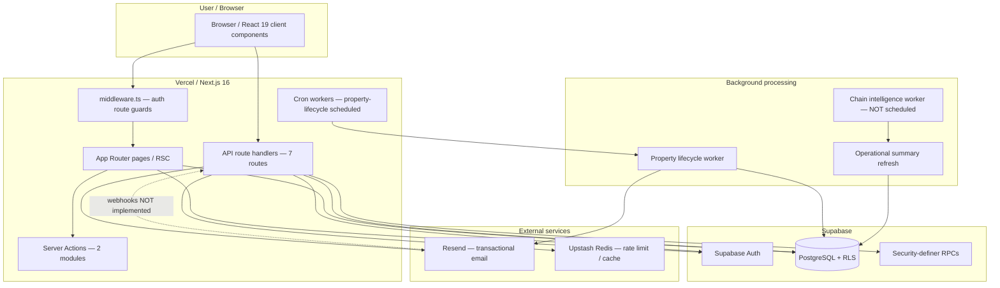
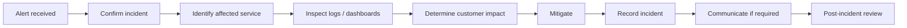

# Pre-Launch Workstream 2 — Production Observability, Incident Alerting & Operational Monitoring

**Status:** **`AUDIT_FOUNDER_APPROVED`** · Phase 1 **`IMPLEMENTATION_COMPLETE_AWAITING_FOUNDER_CONFIGURATION_AND_STAGING_VERIFICATION`** — see [Phase 1 report](./PRELAUNCH_OBSERVABILITY_PHASE1_IMPLEMENTATION.md)  
**Audit date:** 22 July 2026  
**Audit type:** Repository audit and architecture design only — **no Production changes**, **no implementation**, **no third-party product installation**

**Prior workstream:** [Workstream 1 — EA Access & Branch Membership](./PRELAUNCH_EA_ACCESS_FOUNDER_SIGNOFF.md) — **`FOUNDER_APPROVED_COMPLETE`**

---

## Executive summary

Keynetic currently has **partial operational visibility** through Vercel function logs, Supabase provider dashboards, unstructured `console.error` calls, and several **application-owned audit tables** (`email_events`, `property_lifecycle_events`, operational summaries). There is **no automated founder alerting**, **no health/uptime monitoring**, **no application error monitoring SDK**, **no structured logging**, **no React error boundaries**, and **no Resend delivery webhook integration**.

The founder would **not reliably know** about Production outages, error spikes, cron worker failures, email delivery problems, or authentication degradation **before a customer reports it**. Manual inspection of Vercel and Supabase dashboards is required for most failure modes.

**Recommended launch stack (simplest cost-effective architecture):**

| Layer | Recommendation | Phase |
|-------|----------------|-------|
| Uptime | External synthetic monitor on homepage + login + `/api/health` (to be implemented) | 1 |
| Application errors | **Sentry** (browser + server, Production only) after founder approval | 1 |
| Platform logs | Vercel dashboard + optional log drain later | 1 (native) / 3 |
| Database | Supabase dashboard alerts (plan-dependent) + cheap daily `platform_metrics` snapshot | 2–4 |
| Email send failures | Existing `email_events` + Resend dashboard; add webhooks in Phase 3 | 3 |
| Business metrics | Precomputed `platform_operational_metrics` table (calculate-on-write pattern) | 4 |
| Marketing analytics | Defer invasive tracking; optional Vercel Web Analytics on public pages only after PECR decision | 5 |

**Expected early-stage recurring observability cost:** **£0–£35/month** at low traffic (free uptime monitor + Sentry Developer tier + native provider dashboards). Scale risk is **log/telemetry volume**, not base subscription price — safeguards required.

**Launch blockers from observability alone:** **P0** — no automated downtime detection; **P1** — no proactive application error alerting; **P1** — chain intelligence cron not scheduled in `vercel.json`.

---

## PART 1 — Current observability architecture inventory

### Architecture map



### Boundary visibility matrix

| Boundary | Logged | Persisted | Visible to founder | Alertable |
|----------|--------|-----------|-------------------|-----------|
| **Browser JS errors** | Browser console only | No | No | No |
| **React render errors** | None (no error boundary) | No | No | No |
| **Next.js SSR/RSC errors** | Vercel function logs if thrown | No | Manual Vercel log search | No |
| **middleware.ts** | Nothing | No | No | No |
| **API routes** (`app/api/**`) | `console.error` → Vercel logs | Partial (`email_events` for comms) | Manual | No |
| **Server Actions** | Uncaught → Vercel logs | Privacy/GDPR audit tables only | Manual | No |
| **Supabase queries (client)** | Supabase API logs (provider) | Data in tables | Supabase dashboard | Plan-dependent |
| **Supabase RPC failures** | Returned to caller; often `console.error` | Audit tables when RPC succeeds | Manual | No |
| **RLS denials** | Supabase logs (provider) | No app record | Supabase dashboard | Plan-dependent |
| **Supabase Auth** | Supabase Auth logs (provider) | `auth.users` | Supabase dashboard | Plan-dependent |
| **Cron: property-lifecycle** | `console.error` on batch failure | `property_lifecycle_events` per property action | Manual Vercel cron logs | No |
| **Cron: chain-intelligence** | Same pattern | `chain_operational_summary` on success | Manual only; **not scheduled** | No |
| **Resend send API** | `console.error` | `email_events` (`queued`→`sent`\|`failed`) | Dev route `/api/dev/email-events` (dev only) | No |
| **Resend delivery/bounce** | Not captured | `provider_events` column prepared, empty | Resend dashboard only | No |
| **Upstash Redis** | `console.error` on failure | No | Upstash dashboard | Plan-dependent |

### Repository evidence — configuration

| Area | Finding | Evidence |
|------|---------|----------|
| Vercel cron | Only `property-lifecycle` at `0 3 * * *` | `vercel.json` |
| Chain intelligence cron | Route exists; **not in vercel.json** | `app/api/cron/chain-intelligence/route.ts` comment |
| Monitoring SDKs | **None** — no Sentry, no `@vercel/analytics`, no Speed Insights | `package.json`, `app/layout.tsx` |
| Error boundaries | **None** — no `error.tsx`, `global-error.tsx` | repo search |
| Instrumentation | **None** — no `instrumentation.ts` | repo search |
| Health endpoint | **None** | no `/api/health` |
| Structured logging | **None** — ~149 `console.*` calls, mostly unstructured | repo grep |
| Correlation IDs | **None** | — |
| Resend webhooks | **Not implemented** | no webhook route; `append_email_event_provider_event` RPC exists |
| Dev diagnostics | `/api/debug/environment` (404 in production); `/api/dev/email-events` (dev only) | route files |
| Platform admin | `platform_admins` table + privacy admin UI — **no ops dashboard** | migrations, `app/admin/privacy/` |

### API routes inventory

| Route | Purpose | Auth | Logging |
|-------|---------|------|---------|
| `POST /api/communications/homeowner-invitation` | Send homeowner invite email | User session | `[communications]` errors |
| `POST /api/communications/estate-agent-invitation` | Send EA branch invite | User session | Same |
| `GET/POST /api/cron/property-lifecycle` | Daily lifecycle worker | `Bearer CRON_SECRET` | `[lifecycle-worker]` |
| `GET/POST /api/cron/chain-intelligence` | Chain intelligence refresh | `Bearer CRON_SECRET` | `[chain-intelligence-worker]` |
| `GET /api/debug/environment` | Env diagnostic | None (non-prod only) | None |
| `GET /api/dev/email-events` | List `email_events` | Dev + authenticated | None |
| `GET /api/dev/emails/render` | Email preview | Dev only | None |

### Supabase client usage

| Client | File | Used for |
|--------|------|----------|
| Browser anon | `lib/supabase.ts` | Client components |
| Server anon + cookies | `lib/supabase/server.ts` | RSC, API routes, middleware |
| Service role | `lib/supabase/serviceRole.ts` | Cron workers, email pipeline, platform admin, privacy admin |

### Application audit / event tables

| Table | Purpose | Ops value |
|-------|---------|-----------|
| `email_events` | Send attempt lifecycle | Send failure counts; webhook-ready |
| `property_lifecycle_events` | Lifecycle transitions | Worker audit trail |
| `property_delink_events` | Participation delink | Support/audit |
| `chain_completion_events` | Chain completion | Business events |
| `ea_branch_membership_events` | EA team changes | Access audit |
| `gdpr_erasure_audit_events` | GDPR erasure | Compliance |
| `property_operational_summary` | Cached property ops state | Product dashboards |
| `chain_operational_summary` | Cached chain health | Product dashboards |
| `property_lifecycle_states` | Lifecycle state machine | Dormancy tracking |

### Retry mechanisms

| Area | Retry? | Evidence |
|------|--------|----------|
| Resend send | No automatic retry | Single attempt in `lib/communications/resend.ts` |
| Supabase RPC | No app-level retry | Callers return errors |
| Redis cache | Fail-open (unavailable) | `lib/cache/redis.ts` |
| Cron workers | Vercel may retry cron invocation | No idempotency run ledger |
| Email idempotency | Rate limit via `email_events` query | `invitationSendSecurity.ts` |

---

## PART 2 — Error visibility audit

Classification: **GOOD** = founder can discover proactively · **PARTIAL** = logged somewhere, manual inspection · **BLIND SPOT** = silent or user-report only

| # | Failure category | Caught? | Logged? | Where | Persisted? | Founder sees? | Alert? | Retention | PII risk | User impact | Retry? | Visibility |
|---|------------------|---------|---------|-------|------------|---------------|--------|-----------|----------|-------------|--------|------------|
| 1 | Browser/client JS error | No global handler | Browser console | Client only | No | No | No | N/A | Possible | Broken UI | N/A | **BLIND SPOT** |
| 2 | React rendering error | No error boundary | None | — | No | No | No | — | Possible | Error page / blank | N/A | **BLIND SPOT** |
| 3 | Next.js SSR/RSC error | Framework | Vercel logs | Vercel | No | Manual | No | **REQUIRES PLAN CONFIRMATION** | Stack may include paths | Error page | N/A | **PARTIAL** |
| 4 | API route exception | Usually try/catch | `console.error` | Vercel | Sometimes | Manual | No | Plan-dependent | Message may leak detail | JSON error | Case-by-case | **PARTIAL** |
| 5 | Server Action exception | Framework | Vercel logs | Vercel | No | Manual | No | Plan-dependent | Possible | Generic failure | N/A | **PARTIAL** |
| 6 | Supabase query failure | Caller-dependent | Often `console.error` | Vercel + Supabase | No | Manual | No | Plan-dependent | Query errors usually safe | UI error | Rarely | **PARTIAL** |
| 7 | Supabase RPC failure | Caller-dependent | Often `console.error` | Vercel + Supabase | No | Manual | No | Plan-dependent | RPC messages vary | Operation fails | Rarely | **PARTIAL** |
| 8 | RLS/authorisation denial | DB layer | Supabase logs | Supabase | No | Manual | No | Plan-dependent | User ID in logs | Access denied | No | **PARTIAL** |
| 9 | Supabase Auth failure | Auth API | Supabase Auth logs | Supabase | No | Manual | No | Plan-dependent | Email in Auth logs | Login fails | User retries | **PARTIAL** |
| 10 | Login/signup/password reset failure | Auth + UI | Supabase + possible client console | Mixed | No | Manual | No | Plan-dependent | Email addresses | User sees message | User retries | **PARTIAL** |
| 11 | Invitation acceptance failure | RPC returns error | Client `console.error` in places | Browser/Vercel | Partial invitation state in DB | Manual | No | — | Token must not be logged | User blocked | User retries | **PARTIAL** |
| 12 | Resend API failure | Yes | `console.error` | Vercel | `email_events.status=failed` | Manual SQL/dev route | No | DB retained | Recipient email in DB | Send fails | No auto-retry | **PARTIAL** |
| 13 | Email delivery failure post-accept | **No** | Resend dashboard only | Resend | **No webhook** | Resend dashboard | No | Resend retention | Bounce email in Resend | User never receives | N/A | **BLIND SPOT** |
| 14 | Cron invocation failure | Vercel cron | Vercel cron logs | Vercel | No run record | Manual | No | Plan-dependent | Low | Lifecycle stale | Vercel retry? | **PARTIAL** |
| 15 | Lifecycle worker per-property failure | Yes | Collected in result | Vercel response omits detail | `property_lifecycle_events` partial | Manual | No | DB | Property IDs | Delayed lifecycle | No | **PARTIAL** |
| 16 | Chain intelligence refresh failure | Yes | HTTP 500 + console | Vercel | No failure record | Manual | No | — | Chain IDs in response | Stale intelligence | No | **PARTIAL** |
| 17 | Operational summary refresh failure | Per-chain in worker | `console.error` in loader | Vercel | No | Manual | No | — | Chain/property IDs | Stale summaries | No | **PARTIAL** |
| 18 | External API timeout | Caller-dependent | Sometimes console | Vercel | No | Manual | No | — | Low | Operation fails | No | **PARTIAL** |
| 19 | Vercel function timeout | Platform | Vercel logs | Vercel | Partial worker progress | Manual | No | Plan-dependent | Low | 504/500 | Manual re-run | **PARTIAL** |
| 20 | Unhandled promise rejection | Node/runtime | Vercel logs if surfaced | Vercel | No | Manual | No | Plan-dependent | Possible | Undefined | N/A | **BLIND SPOT** |
| 21 | Production 404 spike | Vercel | Vercel request logs | Vercel | No | Manual analytics | No | Plan-dependent | Low | Not found | N/A | **PARTIAL** |
| 22 | Production 500 spike | Vercel | Vercel logs | Vercel | No | Manual | No | Plan-dependent | Possible | Server error | N/A | **PARTIAL** |

---

## PART 3 — Current provider capabilities

> Where capability depends on subscription tier, marked **`REQUIRES FOUNDER/PROVIDER PLAN CONFIRMATION`**. No subscriptions were changed during this audit.

### Vercel

| Capability | Repo evidence | Assessment |
|------------|---------------|------------|
| Deployment failures | Vercel Git integration | Visible in Vercel dashboard; email notifications **REQUIRES PLAN CONFIRMATION** |
| Function logs | All server code uses stdout/stderr | Available in Vercel log viewer; retention **REQUIRES PLAN CONFIRMATION** |
| Runtime errors | No SDK aggregation | Must search logs manually |
| Request logs | Platform default | Status codes visible; retention **REQUIRES PLAN CONFIRMATION** |
| Latency / duration | Platform metrics | Dashboard per route; alerting **REQUIRES PLAN CONFIRMATION** |
| CPU/memory | Limited serverless visibility | High-level only; not app-instrumented |
| Invocation counts | Platform | Dashboard |
| Bandwidth | Platform | Dashboard + billing |
| Web Analytics | **Not configured** | Not in `package.json` or layout |
| Speed Insights | **Not configured** | Not installed |
| Alerts | **None configured in repo** | **REQUIRES PLAN CONFIRMATION** |
| Log drains | **None configured** | Optional export to external SIEM |
| Spend alerts | Account billing settings | **REQUIRES PLAN CONFIRMATION** |

### Supabase

| Capability | Assessment |
|------------|------------|
| Database / API / Auth logs | Available in Supabase dashboard; detail and retention **REQUIRES PLAN CONFIRMATION** |
| Postgres logs / slow queries | Pro+ features vary; **REQUIRES PLAN CONFIRMATION** |
| CPU / memory / connections / disk | Dashboard metrics; alerts **REQUIRES PLAN CONFIRMATION** |
| RLS errors | Visible in logs when logging enabled |
| Auth failures | Auth logs section |
| Backups | Documented 7-day on Pro in GDPR docs; **REQUIRES PLAN CONFIRMATION for Production** |
| Usage/spend controls | Dashboard + billing alerts **REQUIRES PLAN CONFIRMATION** |

### Resend

| Capability | Assessment |
|------------|------------|
| Accepted/sent/delivered/bounced | Resend dashboard |
| Webhooks | **Not configured in Keynetic** — no inbound handler |
| `email_events` integration | Send attempts only (`queued`→`sent`\|`failed`); `provider_events` unused |
| Keynetic receives delivery webhooks | **No** |
| Alerting | Resend dashboard; email alerts **REQUIRES PLAN CONFIRMATION** |
| Retention | Provider-defined |

### Upstash Redis

| Capability | Assessment |
|------------|------------|
| Command errors | `console.error` in app; Upstash dashboard |
| Usage/billing | Upstash console |

---

## PART 4 — Third-party observability options

### Comparison (realistic launch options)

| Option | Browser errors | Server errors | Stack traces | Source maps | Alerting | GDPR/PII | Early cost | Complexity |
|--------|---------------|---------------|--------------|-------------|----------|----------|------------|------------|
| **Sentry** | Excellent | Excellent | Yes | Yes (private) | Email/Slack | Configurable scrubbing | ~$26/mo Dev tier | Medium |
| **Vercel native only** | No | Logs only | Partial | N/A | Plan-dependent | Lower | Included in Vercel | Low |
| **Supabase native only** | No | DB/Auth only | No | N/A | Plan-dependent | EU region option | Included | Low |
| **Better Stack / Logtail** | No | Log aggregation | Via logs | N/A | Yes | Depends | ~$0–25/mo | Medium |
| **Session replay (LogRocket etc.)** | Good | Good | Yes | Yes | Yes | **High PII risk** | $$$ | High — **not recommended at launch** |

### Recommendations

**A. Use at launch (after founder approval to implement):**

1. **External uptime monitor** (Better Uptime free tier, UptimeRobot, or similar) — homepage + login + health endpoint
2. **Sentry** — Production only, browser + Node server, PII scrubbing, environment tags
3. **Vercel + Supabase native dashboards** — manual inspection + configure billing/usage alerts where available
4. **Existing `email_events`** — extend with dashboards/queries in Phase 3

**B. Can wait:**

- Log drains to external SIEM
- Vercel Web Analytics (pending PECR decision)
- Session replay
- OpenTelemetry / distributed tracing
- Custom APM

**C. Should not add (existing providers cover adequately):**

- Separate database monitoring product (Supabase covers infra)
- Duplicate infrastructure uptime tools beyond one external synthetic monitor
- High-cardinality custom metrics platform at launch

---

## PART 5 — Incident alerting design

### Severity model

| Level | Meaning | Response | Notification |
|-------|---------|----------|--------------|
| **P0 — Critical** | Service down or core path broken | Immediate | SMS/email/Slack — immediate |
| **P1 — High** | Major degradation; data/workflow at risk | < 1 hour | Immediate email/Slack |
| **P2 — Medium** | Partial failure; workaround exists | Same day | Digest or delayed alert |
| **P3 — Informational** | Notable but non-urgent | Weekly review | Weekly digest only |

### Recommended alerts (avoid alert fatigue)

| Alert | Severity | Threshold | Window | Destination | Immediate/Digest | Escalation |
|-------|----------|-----------|--------|-------------|------------------|------------|
| Website unavailable | P0 | Synthetic check fails 2/2 regions | 5 min | Founder email + SMS | Immediate | Repeat every 15 min until resolved |
| Sustained 5xx | P0 | >5% of requests 5xx | 10 min | Sentry/Vercel → email | Immediate | P0 if >10% |
| Login failure spike | P1 | Auth failure rate >3× baseline | 15 min | Supabase/Sentry | Immediate | — |
| Database unavailable | P0 | Health check DB probe fails | 2 min | Uptime + Supabase | Immediate | — |
| DB error spike | P1 | RPC/query error rate >3× baseline | 15 min | Sentry | Immediate | — |
| Invitation acceptance failures | P1 | >3 failures same error code | 1 hour | App metric + Sentry | Digest unless >10/hr | — |
| Email send failure spike | P1 | `email_events.failed` >5 in 1 hr | 1 hour | DB snapshot alert | Immediate | — |
| Cron worker did not run | P1 | No successful cron log 26 hr | 26 hr | Vercel cron monitor | Immediate | — |
| Chain intelligence repeated failure | P2 | `errorCount > 0` 3 consecutive runs | 3 days | Worker run table | Digest | Upgrade to P1 if 7 days |
| Lifecycle worker repeated failure | P2 | Batch `errorCount > 0` 3 consecutive | 3 days | Worker run table | Digest | — |
| Stripe webhook failures | P1 | Future — failed webhook count | 1 hour | Stripe dashboard | Immediate | Future |
| Infra usage spike | P2 | >150% of 7-day avg | 24 hr | Provider billing | Digest | — |
| Cost spike | P2 | >120% of monthly budget | Monthly | Billing alerts | Digest | — |

**Explicitly do NOT alert:** single 404, single user JS error, expected RLS denial, idempotent skip, dev/preview environments.

---

## PART 6 — Health check / synthetic monitoring design

### Recommendation: **Yes** — lightweight `/api/health`

**Should test:**

- Next.js route reachable (200)
- Supabase DB reachable (simple `select 1` via service role or anon RPC)
- Optional: Supabase Auth metadata endpoint reachable

**Must NOT expose:**

- Environment variable values
- Service role keys
- Connection strings
- Table counts (except optional internal authenticated admin variant later)
- Stack traces to anonymous callers

**Response shape (public):**

```json
{ "status": "ok" | "degraded" | "down", "checks": { "app": "ok", "database": "ok" }, "timestamp": "ISO-8601" }
```

Return **503** only when app cannot serve traffic; return **200 degraded** if non-critical dependency fails (document choice at implementation).

### External synthetic monitoring (low-cost launch)

| Check | URL | Frequency | Cost |
|-------|-----|-----------|------|
| Homepage | `https://app.keynetic.co.uk/` | 5 min | Free tier |
| Login page | `https://app.keynetic.co.uk/login` | 5 min | Free tier |
| Health | `https://app.keynetic.co.uk/api/health` | 5 min | Free tier |

**Later:** authenticated synthetic journey (create test account) — Phase 2+; higher maintenance.

---

## PART 7 — Business / product operational metrics design

Principle: **calculate on write / precompute; dashboards read cheap summaries.**

### Proposed `platform_operational_metrics` table (future migration)

Single-row or daily-snapshot table updated by cron/worker — **not live COUNT(*) on every page load.**

| Metric | Definition | Likely source | Exists? | Cost | Strategy |
|--------|------------|---------------|---------|------|----------|
| Total registered homeowners | Distinct users with active `property_operational_identities` or `property_members` | `property_operational_identities`, `property_members` | Partial | Medium | Daily snapshot |
| Active homeowners (7d/30d) | Homeowner with activity or login in window | `activities.updated_by='homeowner'`, Auth `last_sign_in_at` | Partial | Medium | Precomputed |
| Total EA users | Distinct users in `ea_branch_members` | `ea_branch_members` | Yes | Cheap | Daily snapshot |
| Active EA users | EA member with branch activity in window | `activities`, `ea_branch_membership_events` | Partial | Medium | Precomputed |
| Paying EA branches | Branches with active Stripe subscription | Future Stripe | No | — | Stripe webhook counters |
| Active EA branches | Branch with ≥1 active member activity in window | `ea_branches`, members, activities | Partial | Medium | Precomputed |
| Total chains | Count of `chains` | `chains` | Yes | Cheap | Daily snapshot |
| Live chains | `completed_at IS NULL` and not fully archived | `chains`, `property_lifecycle_states` | Partial | Medium | Precomputed |
| Completed chains | `chains.completed_at IS NOT NULL` | `chains` | Yes | Cheap | Daily snapshot |
| Withdrawn/broken chains | Segment gap `broken` or delink events | Topology flags + `property_delink_events` | Partial | Expensive live | Worker-derived |
| Single-property chains | One property in chain | `properties` grouped by `chain_id` | Yes | Medium | Precomputed |
| Partially connected chains | Any segment gap `awaiting_connection` | `buildChainTopology` logic | Logic exists | Expensive live | Worker batch nightly |
| Fully connected chains | All segment gaps `connected` | Same | Logic exists | Expensive live | Worker batch nightly |
| Avg properties per chain | Mean property count | `properties` | Yes | Medium | Snapshot |
| Homeowner vs EA-originated moves | `granted_via` / origin metadata | `property_operational_identities.granted_via`, EA assignment tables | Partial | Medium | Snapshot |
| Invitations sent | Count `property_claim_invitations` + EA invites | Invitation tables | Yes | Cheap | Increment on send |
| Invitations accepted | Status transitions | Invitation tables | Yes | Cheap | Increment on accept |
| Invitation conversion rate | accepted / sent | Derived | No | Cheap | Computed from counters |
| Properties managed by EAs | EA-assigned properties | `property_ea_assignments` (or equivalent) | Yes | Cheap | Snapshot |
| Active chains per paying branch | Join branch subscription × live chains | Future | No | — | Post-Stripe |
| Fully connected chains per paying branch | Same | Future | No | — | Post-Stripe |

**Existing product-facing summaries (not founder-global):**

- `chain_operational_summary` — per-chain health (`health_status`, `confidence_score`)
- `property_operational_summary` — per-property ops state
- `agent_branch_property_summaries` view — EA dashboard layer

---

## PART 8 — Active user definitions

### Recommended launch definitions

| Entity | Recommended definition | 7-day window | 30-day window | Trade-off |
|--------|------------------------|--------------|-----------------|-----------|
| **Active homeowner** | User with ≥1 authenticated session **or** ≥1 homeowner-attributed activity update on an active property | Primary founder metric | Trend metric | Auth-only counts login without product use; activity-only misses read-only users — **combine with OR** |
| **Active EA user** | User with active `ea_branch_members` row **and** (session **or** EA-attributed activity) | Primary | Trend | Removed members excluded automatically |
| **Active EA branch** | Branch with ≥1 active member **and** ≥1 branch property with activity in window | Primary | Trend | Ignores dormant branches paying subscription — add Stripe flag later |
| **Active chain** | Chain not completed **and** ≥1 property activity in window | Primary | Trend | Excludes completed chains correctly |

**Most useful founder dashboard (launch):** 30-day totals with 7-day active counts side-by-side.

---

## PART 9 — Privacy-preserving analytics

### Marketing website analytics

| Option | PECR/cookie | GDPR | Cost | Recommendation |
|--------|-------------|------|------|----------------|
| **Vercel Web Analytics** | Cookieless claim; verify PECR for UK | Privacy-friendly positioning | Included/low | **Candidate** for public marketing pages only after legal review |
| **Plausible/Fathom** | Often no cookie banner | EU hosting options | ~£9/mo | Alternative if legal prefers |
| **Google Analytics** | Consent banner required | Higher risk | Free | **Not recommended** at launch |
| **None** | No consent needed | Lowest risk | £0 | Acceptable pre-launch |

### Authenticated product operational metrics

Use **application-owned counters and precomputed tables** — not third-party page tracking inside the authenticated app. This avoids cookie consent complexity for product usage and aligns with data minimisation.

**Distinction:**

- **Marketing:** optional anonymous page views on `/`, `/estate-agents`, legal pages
- **Product:** DB-derived active user / chain metrics (Part 7)

---

## PART 10 — Cost observability foundation

### Provider data availability

| Cost area | Automatic | Manual dashboard | Internal counter needed? |
|-----------|-----------|-------------------|--------------------------|
| Vercel | Billing API limited; dashboard yes | Monthly invoice | Optional: function invocation counter |
| Supabase | Dashboard usage | Monthly invoice | Optional: DB size snapshot |
| Resend | Dashboard sent count | Monthly invoice | **Yes — `email_events` already counts sends** |
| Observability (Sentry) | Sentry quota dashboard | Invoice | Event volume alerts in Sentry |
| Address lookup | N/A future | Provider dashboard | **Yes — per-lookup counter when built** |
| Stripe | Stripe dashboard | Invoice | Webhook-driven counters |

### Recommended internal counters (low cardinality)

| Counter | Source | Purpose |
|---------|--------|---------|
| Emails sent/failed | `email_events` | Cost per email |
| Invitations sent/accepted | Invitation tables + triggers | Conversion + workload |
| Chain intelligence refreshes | Worker run table | Compute cost proxy |
| Lifecycle worker actions | `property_lifecycle_events` | Batch cost |
| Active chains/homeowners/branches | Daily snapshot table | Unit economics denominators |

**Avoid:** per-request custom metrics, per-user trace IDs in metrics labels, full URL logging.

---

## PART 11 — Logging architecture

### Proposed standard (implementation future)

```typescript
// Conceptual — not implemented
log({
  timestamp: ISO8601,
  environment: "production" | "preview" | "development",
  severity: "debug" | "info" | "warn" | "error" | "fatal",
  eventType: "api.request" | "worker.run" | "email.send" | ...,
  correlationId: uuid,
  route: "/api/...",
  operation: "runPropertyLifecycleWorkerBatch",
  durationMs: number,
  success: boolean,
  errorCode: "safe_enum_only", // not raw exception message to stdout in prod
})
```

### Identifier logging policy

| Identifier | Production policy |
|------------|-------------------|
| `userId` | Log raw UUID (pseudonymous) — acceptable with DPIA |
| `propertyId`, `chainId`, `branchId` | Log raw numeric IDs — operational necessity |
| `invitationId` | Log UUID — **never log invitation token** |
| Email address | Avoid in logs; already in `email_events` table with access control |
| Property address | **Do not log** |
| Passwords, tokens, keys | **Never log** |

### Never log

Passwords · access/refresh tokens · service role keys · Stripe secrets · invitation tokens · full reset URLs · unnecessary emails · full property addresses.

---

## PART 12 — Production support / incident workflow



### Minimum runbooks before launch

| Runbook | Trigger |
|---------|---------|
| Application unavailable | P0 uptime alert |
| Database unavailable | Health check / Supabase status |
| Auth outage | Login spike / Supabase Auth |
| Email outage | Send failure spike / Resend status |
| Invitation failure | Acceptance error spike |
| Cron/worker failure | Missed cron / worker errors |
| Data-access/security incident | Manual report / anomaly |
| Stripe/payment incident | Future webhook failures |

Store under `docs/runbooks/` (to be created in implementation phase).

---

## PART 13 — Observability failure modes

| Failure mode | Safeguard |
|--------------|-----------|
| Monitoring service down | External uptime monitor independent of Vercel; multi-channel alert (email + SMS) |
| Alert email same as failed provider | Use separate alert channel (SMS/Slack) for P0; don't rely on Resend for email-outage alerts |
| Logs contain PII | Scrubbing rules in Sentry; logging standard (Part 11) |
| Logging cost explosion | Sample debug logs; rate-limit error capture; no high-cardinality labels |
| Retry loops → log storms | Circuit breaker; aggregate repeated errors |
| Bot traffic → analytics cost | Exclude `/api/*` from Web Analytics; bot filtering |
| One user → error volume | Sentry rate limits; issue grouping |
| Source maps public | Upload to Sentry only; do not deploy source maps publicly |
| Dev errors drown Production | Strict `environment` tags; Production-only alert rules |

---

## PART 14 — Environment separation

| Environment | Vercel | Supabase | Alerting |
|-------------|--------|----------|----------|
| **Development** | Local / optional | Development project | **None** |
| **Preview/Staging** | `staging-test` → Preview | Development Supabase | **None** (or P3 digest only) |
| **Production** | `main` | Production Supabase | **All P0/P1 alerts** |

**Rules:**

- All logs and Sentry events must include `environment` tag from `VERCEL_ENV` / explicit `KEYNETIC_ENV`
- Alert rules filter `environment:production` only
- Preview cron jobs should not page founder
- `CRON_SECRET` distinct per environment

---

## PART 15 — Current blind spots (ranked)

| ID | Blind spot | Severity | Current consequence | Remediation | Complexity | Cost | Launch blocker? |
|----|------------|----------|---------------------|-------------|------------|------|-----------------|
| BS-01 | No automated downtime detection | **P0** | Founder unaware site down | External uptime + `/api/health` | Low | £0 | **Yes** |
| BS-02 | No application error monitoring | **P0** | JS/server errors invisible | Sentry Production | Medium | ~£26/mo | **Yes** |
| BS-03 | No founder alerting | **P0** | All failures require manual checking | Alert rules P0/P1 | Medium | £0–10/mo | **Yes** |
| BS-04 | Email delivery/bounce blind | **P1** | Resend accepts but email bounces silently | Resend webhooks → `email_events` | Medium | £0 | No |
| BS-05 | Chain intelligence cron not scheduled | **P1** | Stale chain intelligence in Production | Add to `vercel.json` | Low | £0 | No |
| BS-06 | No worker run persistence | **P1** | Cannot detect repeated worker failure | `worker_run_events` table | Medium | £0 | No |
| BS-07 | No React error boundaries | **P1** | Client crashes unreported | `error.tsx` + Sentry | Low | Included | No |
| BS-08 | Middleware auth failures silent | **P2** | Auth degradation invisible | Structured auth failure metrics | Low | £0 | No |
| BS-09 | No business metrics dashboard | **P2** | Founder cannot see adoption | Precomputed metrics table | Medium | £0 | No |
| BS-10 | No marketing analytics decision | **P3** | Unknown visitor acquisition | PECR review + optional Vercel Analytics | Low | £0 | No |
| BS-11 | Lifecycle worker errors omitted from HTTP | **P2** | Per-property failures hidden in cron response | Include error summary in response + persist | Low | £0 | No |
| BS-12 | Unhandled promise rejections | **P2** | Silent server failures | Sentry + Node handlers | Low | Included | No |

---

## PART 16 — Implementation roadmap

### Phase 1 — Minimum viable Production observability

| Item | Detail |
|------|--------|
| **Scope** | `/api/health`, external uptime monitor, Sentry (Prod only), `error.tsx`/`global-error.tsx`, environment tags |
| **Files likely changed** | `app/api/health/route.ts`, `app/error.tsx`, `app/global-error.tsx`, `instrumentation.ts`, `next.config.ts`, `package.json` |
| **External config** | Sentry project, uptime monitor URLs, Vercel env vars |
| **DB migration** | No |
| **Third-party account** | Sentry + uptime provider |
| **Recurring cost** | £0–35/mo |
| **Privacy** | Sentry DPA; scrub PII |
| **Founder action** | Approve Sentry; configure alert email/SMS; confirm Vercel plan |

### Phase 2 — Incident alerting

| Item | Detail |
|------|--------|
| **Scope** | P0/P1 alert rules in Sentry + uptime + Vercel/Supabase billing alerts |
| **Files** | Alert config (mostly external); optional `lib/observability/` |
| **DB migration** | No |
| **Cost** | £0 incremental |
| **Founder action** | Confirm Supabase/Vercel alert capabilities on current plan |

### Phase 3 — Email delivery monitoring

| Item | Detail |
|------|--------|
| **Scope** | Resend webhook route, `append_email_event_provider_event`, bounce/complaint alerts |
| **Files** | `app/api/webhooks/resend/route.ts`, `lib/communications/emailEvents.ts` |
| **DB migration** | Possibly extend `email_events.status` enum |
| **Cost** | £0 |
| **Founder action** | Configure Resend webhook URL in Production |

### Phase 4 — Business operational metrics

| Item | Detail |
|------|--------|
| **Scope** | `platform_operational_metrics` + daily cron; founder read-only admin page |
| **Files** | migration, `lib/platformMetrics/`, `app/admin/operations/` |
| **DB migration** | **Yes** |
| **Cost** | £0 |
| **Founder action** | Approve metric definitions |

### Phase 5 — Privacy-preserving analytics

| Item | Detail |
|------|--------|
| **Scope** | Legal review; optional Vercel Web Analytics on public routes only |
| **Files** | `app/layout.tsx` or marketing layout only |
| **DB migration** | No |
| **Founder action** | Legal sign-off on PECR approach |

### Phase 6 — Cost telemetry foundation

| Item | Detail |
|------|--------|
| **Scope** | Monthly cost snapshot script; internal usage counters |
| **Files** | `scripts/platform-cost-snapshot.ts`, docs |
| **DB migration** | Optional `platform_usage_snapshots` |
| **Founder action** | Enter monthly invoices or connect APIs |

### Phase 7 — Runbooks and launch verification

| Item | Detail |
|------|--------|
| **Scope** | Runbooks, alert fire drill, schedule chain-intelligence cron, Production checklist update |
| **Files** | `docs/runbooks/*`, `vercel.json` |
| **Founder action** | Execute fire drill; sign launch observability gate |

---

## PART 17 — Cost recommendation

### Tiers

| Tier | Stack | Fixed monthly | Variable drivers | Notes |
|------|-------|---------------|------------------|-------|
| **Zero/near-zero** | Vercel + Supabase + Resend dashboards only; free uptime | £0 | Founder time | **Insufficient for launch** — no error visibility |
| **Recommended launch** | Above + Sentry Developer + free uptime + health endpoint | **£0–35** | Sentry events, log volume | ~0.3–0.4% of one £99 branch/month |
| **Enhanced (later)** | + log drain, SMS alerts, Plausible analytics | **£50–80** | Log GB, SMS count | After revenue justifies |

### Safeguards against runaway cost

- Sentry quota alerts at 80%
- No debug logging in Production
- Sample performance traces
- Precomputed metrics — no high-frequency COUNT(*)
- Exclude health checks from analytics

---

## RETURN — Consolidated deliverables

### 1. Executive summary

See top of document. **Keynetic is operationally blind without manual dashboard inspection.** Launch requires automated uptime detection, application error monitoring, and founder alerting at minimum.

### 2. Current observability architecture

Part 1 architecture map and boundary matrix.

### 3. Current provider capabilities

Part 3 — Vercel, Supabase, Resend, Upstash; tier-dependent items marked **REQUIRES FOUNDER/PROVIDER PLAN CONFIRMATION**.

### 4. Error visibility matrix

Part 2 — 22 categories classified GOOD/PARTIAL/BLIND SPOT.

### 5. Current blind spots

Part 15 ranked table (BS-01–BS-12).

### 6. What currently alerts the founder automatically

**Nothing from the application.** Possible provider billing emails only — **REQUIRES PLAN CONFIRMATION**. No P0/P1 operational alerting configured in repo.

### 7. What currently requires manual dashboard inspection

- Vercel deployment logs and function errors
- Supabase database, API, and Auth logs
- Resend send/delivery dashboard
- Upstash usage (if configured)
- Direct SQL against `email_events` / audit tables

### 8. What would currently only be discovered from a user report

- Site completely down (no synthetic monitoring)
- Client-side JavaScript errors (no Sentry/error boundary)
- Email delivered-but-bounced/spam
- Partial chain intelligence staleness
- Per-property lifecycle worker failures (unless cron entirely fails)
- Auth degradation without total outage
- Performance degradation
- Invitation UX failures that return generic errors

### 9. Recommended launch observability stack

External uptime + `/api/health` + **Sentry (Production)** + Vercel/Supabase native dashboards + existing `email_events` + Phase 3 Resend webhooks.

### 10. Sentry / third-party recommendation

**Install Sentry at launch (Phase 1)** for browser + server errors with PII scrubbing and Production-only alerts. Do **not** add session replay. Defer log drains and custom APM.

### 11. Health-check / uptime recommendation

Implement public `/api/health` probing app + DB; monitor homepage, login, and health URL via free external synthetic monitor every 5 minutes.

### 12. Incident alert severity model

Part 5 — P0 Critical through P3 Informational with specific thresholds.

### 13. Business operational metrics design

Part 7 — precomputed `platform_operational_metrics`; reuse topology logic for partial/full chain connection counts.

### 14. Active-user definitions

Part 8 — 7-day primary, 30-day trend; combined session + activity OR logic.

### 15. Privacy-preserving analytics recommendation

Part 9 — separate marketing (optional cookieless analytics after legal review) from DB-derived product metrics; no invasive authenticated tracking at launch.

### 16. Cost telemetry foundation

Part 10 — leverage `email_events`, future worker run table, daily snapshots; manual invoice capture until Stripe live.

### 17. Logging / data-minimisation standard

Part 11 — structured fields, identifier policy, explicit never-log list.

### 18. Environment separation design

Part 14 — Production-only alerts; distinct secrets; `VERCEL_ENV` tagging.

### 19. Incident / runbook requirements

Part 12 — eight minimum runbooks; simple founder-run workflow.

### 20. Observability failure-mode safeguards

Part 13.

### 21. P0 / P1 / P2 findings

| Priority | Findings |
|----------|----------|
| **P0** | BS-01 downtime blind · BS-02 no error monitoring · BS-03 no alerting |
| **P1** | BS-04 email delivery · BS-05 CI cron not scheduled · BS-06 worker run persistence · BS-07 error boundaries |
| **P2** | BS-08–BS-09, BS-11, BS-12 |

### 22. Implementation phases

Part 16 — Phases 1–7.

### 23. Expected early-stage recurring observability cost

**£0–35/month** fixed at low traffic; variable driven by Sentry event volume and log retention — monitor with quotas.

### 24. External founder configuration / actions required

1. Approve this audit and Phase 1 implementation  
2. Confirm Vercel plan (log retention, alerts)  
3. Confirm Supabase Production plan (logs, backups, alerts)  
4. Create Sentry organisation/project (EU region recommended)  
5. Configure external uptime monitor with founder email/SMS  
6. Configure Vercel/Supabase billing alerts  
7. Legal review for marketing analytics (Phase 5)  
8. Configure Resend webhooks (Phase 3)

### 25. Database / schema changes eventually required

| Change | Phase |
|--------|-------|
| `platform_operational_metrics` (or daily snapshot) | 4 |
| `worker_run_events` for cron audit | 2 |
| Extend `email_events.status` for `delivered`/`bounced`/`complained` | 3 |
| Optional `platform_usage_snapshots` | 6 |

No migrations required for Phase 1.

### 26. Files changed during this audit

| File | Change |
|------|--------|
| `docs/PRELAUNCH_OBSERVABILITY_AUDIT_AND_ARCHITECTURE.md` | **Created** — this document |
| `docs/PRODUCTION_READINESS_CHECKLIST.md` | **Updated** — §14 Workstream 2 status |

**No application code changed.**

### 27. Documentation status

**`AUDIT_COMPLETE_AWAITING_FOUNDER_APPROVAL`** — implementation **not started**.

### 28. Exact recommendation for first implementation phase

**Phase 1 — Minimum viable Production observability:**

1. Add `/api/health` (app + DB probe, no secrets)  
2. Register free external uptime monitor on `/`, `/login`, `/api/health`  
3. Install and configure **Sentry** for Production only (browser + server, source maps private, PII scrubbing, `environment=production` alert rules)  
4. Add `app/error.tsx` and `app/global-error.tsx` wired to Sentry  
5. Add `instrumentation.ts` for server runtime hooks  
6. Document founder alert destinations (email + optional SMS for P0)  
7. Configure Vercel and Supabase billing/usage alerts available on current plan  

**Do not yet:** Resend webhooks, business metrics migrations, marketing analytics, log drains, or Staging/Development alerting.

---

## Static verification

| Check | Result |
|-------|--------|
| Application code modified | **No** |
| Documentation references verified | Architecture paths cited from repository audit |
| Build/tsc/lint | **Not run** — no code changes; baseline unchanged from 22 Jul 2026 |

---

*End of Pre-Launch Workstream 2 audit.*
