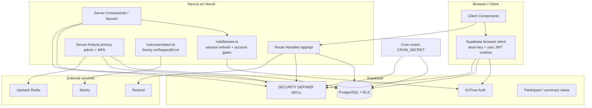

# Pre-Launch Platform Security Architecture Audit

**Workstream:** Pre-Launch Operational Readiness — Platform Security Architecture Review  
**Status:** **`SECURITY_PHASE1_REMEDIATED_ON_DEVELOPMENT_AWAITING_FOUNDER_REVIEW`**  
**Audit date:** 25 July 2026  
**Audit type:** Repository + migration evidence audit only — **no fixes applied**

**Related:** [Production Readiness Checklist §14.3 D–F](./PRODUCTION_READINESS_CHECKLIST.md) · [Auth Architecture](./AUTH_ARCHITECTURE.md) · [EA Access sign-off](./PRELAUNCH_EA_ACCESS_FOUNDER_SIGNOFF.md) · [Provider review](./PRELAUNCH_PROVIDER_REVIEW_SUPABASE_VERCEL_22JUL2026.md)

---

## Executive security assessment

Keynetic’s **intended** security model is sound: Supabase Auth cookie sessions, server-side `getUser()` checks, Next.js middleware account-type gates, server layout guards on chain/property routes, privacy-preserving participant **views**, and EA branch controls hardened via RPC-only role mutation (founder-verified 29/29 on Development).

However, **direct PostgREST/RPC access with the public anon key can bypass the UI** when database grants and SECURITY DEFINER functions do not re-check resource ownership. Repository migration analysis identified **multiple authenticated-user RPCs that accept a `property_id` (or no ID) without verifying the caller’s relationship to that resource**. Separately, **Development Supabase probes documented in the Production Readiness Checklist show base-table RLS failures** (unrelated authenticated users reading `properties`, `chains`, and `activities`), meaning the UI/view privacy layer is **not sufficient** if an attacker calls the API directly.

**Answer to the launch question:**

> Can an unauthorised person access, alter, or cause disclosure of data they should not have simply by bypassing the UI?

**On Development (live verified 25 Jul 2026): PARTIAL YES** — ungated SECURITY DEFINER RPCs allow cross-tenant lifecycle read/write, invitation metadata disclosure, and operational enumeration; **base-table RLS probes now pass** (historical SEC-003 probe stale). **Anon can read lifecycle signals** for known property IDs via PostgREST.  
**On Production Supabase:** **NOT PROVEN** — Production branch state is **Unknown**; `main` application code is also materially behind `staging-test`.

**Phase 2 observability, Stripe, Google OAuth, and address lookup were not started.** No application code, migrations, or provider settings were modified during this audit.

---

## 1. Security architecture map

### 1.1 Trust-boundary diagram



### 1.2 Boundary summary

| Boundary | AuthN | AuthZ | Validation layers | Credential | User-controlled IDs |
|----------|-------|-------|-------------------|------------|-------------------|
| Browser → Supabase PostgREST | Supabase session JWT (cookie) | **RLS + RPC internal checks** | Client + DB | `NEXT_PUBLIC_SUPABASE_ANON_KEY` | **Yes** — all client `.from()` / `.rpc()` args |
| Browser → Next API routes | Session via `getUser()` on protected routes | Route-specific + RPC | Server | Anon key in server client | Yes — body/query |
| Middleware gated pages | `getUser()` | `evaluateProtectedRouteAccess()` account type + email verify | Server | Anon key | Path params |
| Chain/property layouts | `getUser()` | `is_chain_operational_viewer` / participant view / EA assignment RPC | Server | Anon key | `chainId`, `propertyId` route params |
| Cron workers | `CRON_SECRET` Bearer | Secret only | Server | Service role after auth | No |
| Privacy admin actions | `getUser()` + AAL2 MFA + platform admin | Per-action re-check + service role RPCs | Server | Service role post-gate | `requestId`, emails |
| Public health | None | None | Server | Anon key (HEAD probe) | `?probe=app` only |
| Anon → `preview_ea_branch_invitation(token)` | Token possession | Token hash lookup | DB | Anon key | `token` string |

---

## 2. Authentication / JWT architecture verdict

| Question | Verdict | Evidence |
|----------|---------|----------|
| Is Supabase Auth the sole token issuer? | **YES** | No `jose`/`jsonwebtoken`; all auth via `@supabase/ssr` + GoTrue |
| Does Keynetic create custom JWTs? | **NO** | — |
| Does Keynetic sign JWTs? | **NO** | — |
| Manual JWT signature validation? | **NO** | — |
| Decode JWT and trust claims without verification? | **NO** — uses `getUser()` | `middleware.ts`, guards, API routes |
| Application tokens treated as auth credentials? | **NO** — invitation tokens are **capability** tokens for specific flows, not session JWTs | Claim/join flows |
| `getSession()` used? | **NO** | Grep: zero production usage |
| Roles from JWT metadata for authZ? | **NO** — DB membership / RPCs | EA branch roles in `ea_branch_members`, not JWT claims |
| Session trusted after permission removal? | **Auth session persists; branch/property authZ revoked** | EA sign-off tests; RLS/RPC must enforce |
| Logout consistent? | **YES** — `signOut()` in nav shells | `Navbar.tsx`, `AgentShell.tsx` |
| Password reset safe? | **YES** — server `verifyOtp` recovery-only on `/auth/confirm` | `app/auth/confirm/route.ts` |
| Redirects constrained? | **Mostly YES** — allow-lists on login/MFA/auth-confirm; **gap on verify-email `next` Link** | See SEC-201 |

### Auth flow map (AuthN vs AuthZ)

| Flow | Authentication | Authorisation |
|------|----------------|---------------|
| Homeowner signup/login | Supabase `signUp` / `signInWithPassword` | Middleware account type; email verify gate for transaction routes |
| EA signup/login | Same + profile creation RPC | EA onboarding gates; branch membership separate |
| EA onboarding | Session required | Company/branch creation RLS + RPCs |
| EA invitation (new account) | Signup then session | Token RPC + email match on accept |
| EA invitation (existing account) | Session required | `email_mismatch` block (founder verified) |
| Password reset | Email link → server OTP | Recovery session only |
| Email confirmation | Supabase email (not app `/auth/confirm` for signup yet) | `email_confirmed_at` gate |
| Logout | `signOut()` | — |
| Removed EA Staff | Auth account remains | Branch/property RPC + RLS deny (founder verified) |
| Ownership transfer | Session | Owner-only RPC `transfer_ea_branch_ownership` |
| Property claim token | Optional session for claim | Token RPC `resolve_property_claim_invitation_token` |
| Homeowner invitation email send | Session | RPC `validate_property_claim_invitation_for_email_send` |

---

## 3. Supabase anon exposure verdict

**Founder question:** *If someone has Supabase URL + anon key, what can they access without the website?*

| Operation | Intended | Repository-final state | Notes |
|-----------|----------|------------------------|-------|
| **SELECT** sensitive tables | Deny | **Deny** — table grants revoked; RLS enabled | Effectiveness depends on RLS enforcement on deployed DB |
| **INSERT/UPDATE/DELETE** | Deny | **Deny** on sensitive tables | Same caveat |
| **EXECUTE** RPCs | Minimal | **`preview_ea_branch_invitation(text)` only** | `20260712200000` — token-gated pre-signup preview |
| Read `properties`/`chains`/etc. | Deny | **Policy: deny** | Development probe showed **authenticated** cross-reads; anon blocked on `properties` probe |

**Anon verdict:** Repository migrations **intend** deny-by-default. **Only deliberate anon RPC is EA invitation preview with valid token.** Historical `email_events` RPC grants to anon/authenticated were **revoked** in `20260713000000` — confirm applied on every environment.

---

## 4. Arbitrary authenticated-user exposure verdict

An authenticated user **with no relationship** to target data:

| Vector | Verdict | Key evidence |
|--------|---------|--------------|
| Direct table SELECT on `properties`, `chains`, `activities` | **FAIL on Development probe** | Checklist §2 RLS probe; stranger sees rows |
| `chain_properties_participant` view | **PASS** (privacy view) | Probe OK — peer addresses nulled |
| `record_property_lifecycle_transition(property_id, …)` | **FAIL** | Only checks `auth.uid() is not null` — `20260714120000` |
| `get_property_lifecycle_signals(property_id)` | **FAIL** | No membership check — returns operational context JSON |
| `get_latest/active_property_claim_invitation(property_id)` | **FAIL** | Returns full invitation row to any authenticated caller |
| `report_multiple_operational_homeowners()` | **FAIL** | Platform-wide property/user UUID enumeration |
| EA branch RPCs (remove, transfer, invite) | **PASS** (architecture) | Owner/admin checks in `20260721100000` migrations; 29/29 Dev suite |
| GDPR / platform admin RPCs | **PASS** | Revoked from authenticated; service_role + MFA gates |
| `ea_branch_directory` SELECT | **PASS by design** | Any authenticated user sees **all registered branches** (homeowner search UI) — not a bypass, intentional directory |

---

## 5. IDOR / BOLA verdict

**UI hiding is not accepted as a boundary.** Server layout guards exist on `staging-test` for `/chain/[chainId]`, `/property/[propertyId]`, `/buyer-ready/[chainId]` (`requireChainParticipantForRoute`, `requirePropertyParticipantForRoute`).

| Surface | UI guard | Server guard | DB RLS/RPC | Bypass risk |
|---------|----------|--------------|------------|-------------|
| Chain pages | Middleware + layout | `is_chain_operational_viewer` | View + policies | **HIGH** if base RLS fails or RPC ungated |
| Property pages | Middleware + layout | Participant view / EA assignment | RLS + RPC | **HIGH** for lifecycle/invitation RPCs |
| Property stage update (client) | Chain UI | None on client call | `properties` UPDATE policy | Depends on RLS |
| EA team management | Owner UI | Client → RPC | RPC-only role mutation | **LOW** (hardened) |
| Invitation email send | EA UI | API + validation RPC | RPC + rate limits | **LOW** |
| Privacy admin | Admin UI | MFA + platform admin | Service role RPCs | **LOW** (62/62 verifier) |
| Production `main` branch | **Missing** vs staging | **Unknown on Production** | **Unknown** | **HIGH until merge + DB verify |

**IDOR/BOLA verdict:** **FAIL for direct Supabase API abuse** due to ungated RPCs and Development base-table RLS probe failures. **PASS for EA branch membership controls** (founder-verified scope) when calling hardened RPCs.

---

## 6. RLS verdict

Repository migrations define comprehensive RLS for Phase 5 privacy, EA foundation, lifecycle, and GDPR. **Final intended state** (cumulative migrations):

- `properties`, `property_members`, `activities`, `chains`, `chain_nodes` — participant/viewer scoped policies
- `property_claim_invitations` — **no direct table grants**; RPC-only (undermined by helper RPC grants)
- GDPR / `platform_admins` / `email_events` — service_role only (post-hardening)
- `ea_branch_members` — authenticated UPDATE **revoked**; RPC-only role changes

**Development probe (documented 2026-06-06, checklist §2):** authenticated stranger reads **~164 properties**, **~215 property_members rows**, **~133 activities**, chain access codes via base `chains` table. Automated script `verify-participant-privacy-rls.mjs` → **10/11 pass** (fails peer base-table read).

**RLS verdict:** **Migration definitions: PASS intent. Deployed Development enforcement: FAIL probe. Production: NOT PROVEN.**

---

## 7. RPC / function security verdict

~90 SECURITY DEFINER functions; majority correctly scope via `auth.uid()`, `is_property_member`, `is_ea_assigned_to_property`, `is_chain_operational_viewer`, or branch admin checks.

**Critical gaps (authenticated EXECUTE, insufficient internal checks):**

| Function | Issue | Migration |
|----------|-------|-----------|
| `record_property_lifecycle_transition` | Any authenticated user can transition **any** property lifecycle state | `20260714120000` |
| `get_property_lifecycle_signals` | Reads property/chain/claim/lifecycle context for **any** ID | `20260714120000` |
| `get_latest_property_claim_invitation` | Returns full invitation row including `invitation_token_hash` | `20260615000000` |
| `get_active_property_claim_invitation` | Same for active invitation | `20260615000000` |
| `report_multiple_operational_homeowners` | Platform-wide anomaly export with user UUIDs | `20260714140000` |
| `property_invitation_is_pending` | Existence oracle, no gate | `20260714160000` |
| `homeowner_has_meaningful_participation` | Existence oracle, no gate | `20260714160000` |

**EA hardened RPCs (preserve 29/29 guarantees):** `remove_ea_branch_member`, `transfer_ea_branch_ownership`, `accept_ea_branch_invitation`, invitation create/revoke — static verifier **5/5 PASS** (`verify-ea-branch-access-revocation.ts`).

**RPC verdict:** **Mixed — EA branch path PASS; lifecycle/invitation helper path FAIL.**

---

## 8. Service-role / secret security verdict

| Variable | Classification | Client exposure risk |
|----------|----------------|---------------------|
| `NEXT_PUBLIC_SUPABASE_URL` | PUBLIC BY DESIGN | Yes |
| `NEXT_PUBLIC_SUPABASE_ANON_KEY` | PUBLIC BY DESIGN (RLS-bound) | Yes |
| `NEXT_PUBLIC_SENTRY_DSN` | PUBLIC BY DESIGN | Yes |
| `NEXT_PUBLIC_APP_URL` | PUBLIC BY DESIGN | Yes |
| `NEXT_PUBLIC_*` Sentry/Supabase flags | PUBLIC BY DESIGN | Yes |
| `SUPABASE_SERVICE_ROLE_KEY` | **SERVER-ONLY SECRET** | **Not imported in client components** (verified) |
| `RESEND_API_KEY` | **SERVER-ONLY SECRET** | Server modules only |
| `CRON_SECRET` | **SERVER-ONLY SECRET** | Cron auth only |
| `UPSTASH_REDIS_REST_*` | **SERVER-ONLY SECRET** | Server only |
| `GDPR_SUPPRESSION_HMAC_KEY` | **SERVER-ONLY SECRET** | Server only |
| `SENTRY_AUTH_TOKEN` | **BUILD SECRET** | Build-time only; maps disabled without token |
| `PLATFORM_ADMIN_USER_IDS` | **SERVER ENV — REVIEW** | Not in client bundle; bootstrap bypass if set in Production |

**No hardcoded secret values found in tracked source.** `.env*` gitignored. `/api/debug/environment` exposes **existence flags only** (non-production).

**Future Stripe requirements (not implemented):** secret key + webhook signing secret server-only; never trust client price/amount; webhook signature verification; server-side entitlement checks; idempotency keys.

**Verdict:** **PASS** for secret hygiene in repo; **conditional PASS** for runtime (depends on Vercel env configuration not audited here).

---

## 9. URL / SSRF / open-redirect verdict

| Control | Status |
|---------|--------|
| Login `next` param | Allow-list style — rejects `://`, requires `/` prefix |
| Auth confirm `next` | Explicit allow-list |
| Admin MFA `next` | Strict allow-list `/admin/privacy`, `/admin/mfa` |
| Verify-email `next` | **Used directly in `<Link href={nextDestination}>` without sanitization** |
| Server-side `fetch()` to user URLs | **None found** in app/lib |
| Host header trust | `NEXT_PUBLIC_APP_URL` / `APP_URL` for email links |
| Invitation URLs | Built server-side with configured app origin |

**SSRF verdict:** **PASS** (no server-side user-controlled fetch).  
**Open redirect verdict:** **PARTIAL** — verify-email `next` gap (SEC-201).

---

## 10. API routes / Server Actions verdict

| Route | AuthZ summary | Risk |
|-------|---------------|------|
| `GET /api/health` | Public | Low |
| `GET /api/debug/environment` | Blocked in production | Low (staging metadata) |
| `GET /api/dev/email-events` | Dev + any authenticated user + service role read | **Medium in local dev** |
| `GET /api/dev/emails/render` | Dev only, **no auth** | **Medium in local dev** |
| `GET/POST /api/cron/*` | CRON_SECRET timing-safe | Low if secret strong |
| `POST /api/communications/*` | Session + validation RPC | Low |
| Privacy admin Server Actions | MFA AAL2 + platform admin | Low (verified) |
| MFA Server Actions | Platform admin membership | Low |

**Middleware does not cover `/api/**`** — each route self-guards.

**Verdict:** **PASS** for production-facing routes; **PARTIAL** for dev-only surfaces.

---

## 11. Invitation / token security verdict

| Aspect | Assessment |
|--------|------------|
| Token entropy | Random tokens; stored as **SHA-256 hash** in DB |
| Expiry | EA + claim invitations expire (RPC-enforced) |
| Single-use / revoke | Implemented via RPC lifecycle |
| Wrong-email | **`email_mismatch` block** — founder verified (UX issue FD-042/043 separate) |
| Token in logs/Sentry | Scrubber redacts query keys `token`, `invitation_token`, etc. |
| Token possession alone | Grants **specific** join/claim capability, not full account |
| Direct RPC metadata leak | **FAIL** — helper RPCs expose invitation rows cross-property |

---

## 12. Rate limiting / abuse verdict

| Surface | Control |
|---------|---------|
| Login/signup/reset | **Supabase Auth provider limits only** — no app-layer Upstash |
| Invitation email send | DB-backed 3/15min + 60s idempotency |
| Privacy admin subject lookup | Upstash 20/min, fail-closed |
| Cron | Secret-only |
| Claim/join RPCs | DB validation; no global rate limit |

**Verdict:** **PARTIAL** — invitation sends protected; auth endpoints rely on Supabase defaults.

---

## 13. Cron / background security verdict

| Route | Auth | Scheduled |
|-------|------|-----------|
| `/api/cron/property-lifecycle` | CRON_SECRET + timing-safe compare | **Yes** — `vercel.json` `0 3 * * *` |
| `/api/cron/chain-intelligence` | Same | **No** — route exists, not in `vercel.json` |

Service role used **after** cron auth. Worker uses leases/idempotency patterns.

**Verdict:** **PASS** for property-lifecycle cron auth design.

---

## 14. Browser / header security verdict

Implemented in `lib/security/httpHeaders.ts` via `next.config.ts`:

- CSP (non-dev), HSTS (production), `X-Frame-Options: DENY`, `Referrer-Policy`, `Permissions-Policy`, `COOP`
- Verified by `scripts/verify-http-security-headers.mjs` — **PASS**

**Verdict:** **PASS** — proportionate for current architecture.

---

## 15. Dependency / build security verdict

| Package | Version | Notes |
|---------|---------|-------|
| `next` | 16.2.6 | npm audit reports known advisories; fix in 16.2.11 (outside current pin) |
| `@supabase/ssr` | 0.10.3 | Current |
| `@sentry/nextjs` | 10.67.0 | Current |

`npm audit --omit=dev`: **high** findings in `next`, `postcss`, `brace-expansion`, `@babel/core` — classify as **track and plan upgrade**, not automatic launch blocker unless exploit path applies to Keynetic config (no custom server rewrites SSRF surface in repo).

Source maps: upload **disabled** without `SENTRY_AUTH_TOKEN`.

**Verdict:** **PARTIAL** — monitor Next.js advisory patch; no committed secrets.

---

## 16. EA access regression verdict

**Status: PASS (no reopening)** — static verifier **5/5 PASS**. Founder sign-off preserved:

| Guarantee | Evidence |
|-----------|----------|
| One Owner per branch | Deferred trigger in `20260721100000` |
| Staff cannot promote/demote | UPDATE revoked; RPC-only |
| Owner team management | Founder Staging manual PASS |
| Removed Staff loses access | Founder PASS + RLS/RPC |
| Re-invite works | Founder PASS |
| Ownership transfer atomicity | Founder PASS |
| Invitations cannot create Owner | `owner_invitation_not_allowed` in migration |
| Cross-branch isolation | RPC checks (not re-tested live in this audit) |

**Caveat:** Guarantees apply to **Development/Staging codebase + migrations**. **Production parity not verified.**

---

## 17. Attacker scenario matrix (20 scenarios)

| # | Scenario | Result | Evidence |
|---|----------|--------|----------|
| 1 | Logged-out visitor with URL + anon key | **PARTIAL** | Table reads denied by policy intent; `preview_ea_branch_invitation` with token only anon RPC |
| 2 | Homeowner changes property UUID in API | **FAIL** | Ungated lifecycle RPCs; Dev base-table UPDATE policy untested but RPC allows state change |
| 3 | Homeowner accesses another chain | **FAIL** on Dev base tables; **PASS** via participant view path | Checklist probe vs view probe |
| 4 | EA Staff becomes Owner | **PASS** | RPC blocks; UPDATE revoked |
| 5 | Removed EA Staff uses bookmarked property URL | **PASS** | Layout `notFound()` + RPC deny (founder verified) |
| 6 | EA Branch A → Branch B data | **PASS** (RPC design) | Branch-scoped RPCs; not live-pentested here |
| 7 | Non-EA user calls EA team RPCs | **PASS** | `not_branch_admin` / not member errors |
| 8 | User modifies client-side role state | **PASS** | AuthZ from DB not client state |
| 9 | Expired/revoked invitation link | **PASS** | RPC rejects expired/revoked |
| 10 | Invitation opened while logged into wrong account | **PASS** | `email_mismatch` |
| 11 | User manipulates redirect/return URL | **PARTIAL** | Login/MFA guarded; verify-email `next` unsanitized |
| 12 | Attacker invokes cron endpoint | **PASS** | CRON_SECRET required |
| 13 | Client accesses service-role | **PASS** | No client import of service role module |
| 14 | Direct PostgREST bypass UI | **FAIL** | Ungated RPCs + Dev RLS probe |
| 15 | User supplies another user's UUID to RPC | **FAIL** | Lifecycle + invitation helper RPCs |
| 16 | Repeated invitation/email sends | **PARTIAL** | Rate limits on send API; not on all RPC paths |
| 17 | Browser bundle inspection for secrets | **PASS** | Only public env vars in bundle |
| 18 | Error path leaks sensitive data | **PARTIAL** | Branded error UI; Sentry scrubber; some `console.error` in codebase |
| 19 | Stale session after permission removal | **PARTIAL** | Session remains; authZ revoked at DB (EA verified) |
| 20 | Cross-company EA access | **PASS** (design) | Company/branch scoping in RPCs |

---

## 18. Vulnerability register

### P0 — Critical launch blockers

#### SEC-001 — Ungated lifecycle state mutation RPC

| Field | Detail |
|-------|--------|
| **Severity** | P0 |
| **Surface** | `record_property_lifecycle_transition` |
| **Threat actor** | Any authenticated user |
| **Prerequisites** | Valid Supabase session |
| **Exploit path** | `supabase.rpc('record_property_lifecycle_transition', { p_property_id: victimId, p_to_state: 'archived', ... })` |
| **Impact** | Cross-tenant lifecycle manipulation, audit pollution, potential downstream automation triggers |
| **Evidence** | `20260714120000_property_lifecycle_foundation.sql` L278–280 — only `auth.uid() is not null` |
| **Existing mitigation** | UI does not expose to non-participants; **insufficient** |
| **Remediation** | Add `is_property_member` / operational participant check **or** revoke `authenticated` grant and route through authorized wrapper |
| **Regression tests** | RPC negative test: non-member cannot transition |
| **Launch blocker** | **YES** |

#### SEC-002 — Ungated lifecycle signals read RPC

| Field | Detail |
|-------|--------|
| **Severity** | P0 |
| **Surface** | `get_property_lifecycle_signals` |
| **Threat actor** | Any authenticated user |
| **Exploit path** | Direct RPC with arbitrary `p_property_id` |
| **Impact** | Cross-tenant operational intelligence disclosure (claim status, chain dates, member counts) |
| **Evidence** | `20260714120000` L144–171 — no auth.uid() membership check |
| **Remediation** | Internal membership gate or revoke authenticated grant (worker uses service_role grant from `20260714190000`) |
| **Launch blocker** | **YES** |

#### SEC-003 — Base-table RLS not enforced on Development

| Field | Detail |
|-------|--------|
| **Severity** | P0 |
| **Surface** | `properties`, `property_members`, `activities`, `chains` |
| **Threat actor** | Authenticated stranger |
| **Exploit path** | Direct PostgREST SELECT/UPDATE on base tables |
| **Impact** | Mass cross-tenant read; peer address exposure via base `properties`; chain access codes |
| **Evidence** | `PRODUCTION_READINESS_CHECKLIST.md` §2 RLS probe; `verify-participant-privacy-rls.mjs` 10/11 |
| **Remediation** | Run catalog SQL on Development; re-apply `20260610220000` / `20260610225000`; verify `relrowsecurity` |
| **Launch blocker** | **YES** (must prove fix on Production branch pre-go-live) |

#### SEC-004 — Invitation helper RPCs leak cross-property metadata

| Field | Detail |
|-------|--------|
| **Severity** | P0 |
| **Surface** | `get_latest_property_claim_invitation`, `get_active_property_claim_invitation` |
| **Threat actor** | Any authenticated user |
| **Exploit path** | RPC with victim `property_id` |
| **Impact** | Invitation metadata disclosure (hashes, timestamps, creator UUID) |
| **Evidence** | `20260615000000` L88–110 — SECURITY DEFINER, no caller check |
| **Remediation** | Revoke authenticated EXECUTE or add `is_ea_assigned_to_property` gate |
| **Launch blocker** | **YES** |

---

### P1 — High severity (fix before Production launch)

#### SEC-101 — Platform-wide operational homeowner enumeration RPC

| Field | Detail |
|-------|--------|
| **Severity** | P1 |
| **Surface** | `report_multiple_operational_homeowners()` |
| **Impact** | All anomalous properties + user UUID arrays exposed to any authenticated user |
| **Evidence** | `20260714140000` L185–224 |
| **Remediation** | Restrict to `service_role` or platform admin |
| **Launch blocker** | **YES** |

#### SEC-102 — Production Supabase security state unknown

| Field | Detail |
|-------|--------|
| **Severity** | P1 |
| **Impact** | Production may differ from Development partial-apply history |
| **Evidence** | Checklist §1 — Production DB **Unknown** |
| **Remediation** | Phase A pre-flight catalog + policy inventory before go-live |
| **Launch blocker** | **YES** |

#### SEC-103 — Production application branch (`main`) lacks staging security code

| Field | Detail |
|-------|--------|
| **Severity** | P1 |
| **Impact** | No PR5 privacy layer, route layouts, EA platform on Production code path |
| **Evidence** | Checklist §1–3 |
| **Remediation** | Merge `staging-test` + commit route auth before Production deploy |
| **Launch blocker** | **YES** |

#### SEC-104 — No application-layer auth rate limiting

| Field | Detail |
|-------|--------|
| **Severity** | **P2** (revised 2026-07-25 — see §26) |
| **Impact** | Browser-direct auth relies on Supabase GoTrue limits; generic errors reduce enumeration; no per-account lockout |
| **Evidence** | `docs/SEC-104_AUTHENTICATION_ABUSE_RATE_LIMITING_AUDIT.md`; `AUTH_SECURITY_AUDIT.md`; no Upstash on login routes |
| **Remediation** | **Minimum Launch:** founder Supabase Dashboard verification (P1 gate). Optional later: proxy/CAPTCHA/Auth Hook |
| **Launch blocker** | **Supabase Auth Dashboard verification on Production** — not full Redis auth proxy |
| **Status** | **AUDIT COMPLETE — OPEN** |

#### SEC-105 — `email_events` RPC hardening must be verified on all environments

| Field | Detail |
|-------|--------|
| **Severity** | P1 |
| **Impact** | Pre-`20260713000000` grants allowed cross-tenant email PII read/write |
| **Evidence** | `20260705000000` + fix `20260713000000` |
| **Remediation** | Confirm migration applied Production + Development |
| **Launch blocker** | **YES if not applied** |

---

### P2 — Important hardening

| ID | Title | Summary |
|----|-------|---------|
| SEC-201 | Verify-email open redirect via `next` | `app/verify-email/page.tsx` L232 — unsanitized `href` |
| SEC-202 | `PLATFORM_ADMIN_USER_IDS` bootstrap | Admin bypass via env if set in Production |
| SEC-203 | Dev API surfaces | `/api/dev/emails/render` no auth when `NODE_ENV=development` |
| SEC-204 | Client updates base `properties` table | `ChainContext.tsx` L826 — relies entirely on RLS |
| SEC-205 | Invitation existence oracles | `property_invitation_is_pending`, `homeowner_has_meaningful_participation` |
| SEC-206 | Supabase Dashboard password policy alignment | App policy bypass if Dashboard weaker |
| SEC-207 | npm audit — Next.js/postcss advisories | Track upgrade to patched Next 16.2.11+ |

---

### P3 — Low risk / defence in depth

| ID | Title | Summary |
|----|-------|---------|
| SEC-301 | Middleware session refresh excludes public auth routes | Edge-case stale session |
| SEC-302 | Unstructured `console.error` (~149) | Possible log leakage to Vercel |
| SEC-303 | Chain intelligence cron not scheduled | Stale intelligence, not direct security breach |
| SEC-304 | `ea_branch_directory` exposes all branches | Intentional directory — document privacy expectation |

---

## 19. Production launch blockers (security)

1. **SEC-001, SEC-002, SEC-004** — Fix ungated RPCs  
2. **SEC-003** — Prove base-table RLS on Development, then Production pre-flight  
3. **SEC-101** — Restrict enumeration RPC  
4. **SEC-102, SEC-103** — Production DB + code parity  
5. **SEC-105** — Confirm email_events hardening applied  

---

## 20. Recommended remediation order

| Phase | Scope | Findings |
|-------|-------|----------|
| **1 — Database RPC/RLS hotfix** | New migration (separate approved task) | SEC-001, 002, 004, 101, 003, 105 |
| **2 — Environment verification** | SQL catalog on Dev + Production | SEC-003, 102 |
| **3 — Application merge** | `staging-test` → Production deploy path | SEC-103 |
| **4 — App hardening** | Redirect fix, rate limits | SEC-201, 104 |
| **5 — Dependency patch** | Planned Next upgrade | SEC-207 |

### Tests required per phase

| Phase | Tests |
|-------|-------|
| RPC hotfix | Extend `verify-participant-privacy-rls.mjs`; new RPC negative integration tests; re-run EA 29/29 |
| RLS verify | Catalog SQL from checklist §5; `verify-participant-privacy-rls.mjs` 11/11 |
| App merge | Staging smoke + layout guard tests |
| Hardening | Redirect unit tests; optional auth rate-limit verifier |

---

## 21. Areas not proven from repository evidence alone

- Live Production Supabase RLS policy catalog  
- Whether Development RLS probe failures persist today (probe dated June 2026; migrations may have been re-applied since)  
- Supabase Dashboard Auth settings (MFA, password length, CAPTCHA, redirect URLs)  
- Vercel environment variable values  
- Live penetration of RPCs against deployed Preview  
- Performance/load behaviour (explicitly out of scope)

---

## 22. Verification commands run (read-only / static)

| Command | Result |
|---------|--------|
| `npx tsx scripts/verify-ea-branch-access-revocation.ts` | **5/5 PASS** |
| `npx tsx scripts/verify-privacy-admin-security.ts` | **62/62 PASS** (runs against Development) |
| `node scripts/verify-http-security-headers.mjs` | **PASS** |
| `node scripts/verify-invitation-send-security.mjs` | **PASS** |
| `npx tsc --noEmit` | **PASS** |
| `npm run build` | **PASS** |
| `npm run lint` | **55 / 22 / 33** (baseline) |
| `npm audit --omit=dev` | **High** advisories in `next`, `postcss`, etc. — classified P2 |

**Not run:** `verify-ea-branch-access-dev-integration.ts --execute` (mutating), `verify-participant-privacy-rls.mjs` (requires live Supabase credentials).

---

## 23. Recommended next action (requires founder approval)

**Approve Phase 1 remediation implementation:** database migration to gate/revoke ungated RPCs + Development RLS catalog verification and fix — **before** Production Supabase migration or Production deploy.

**Status:** `SECURITY_LIVE_VERIFICATION_COMPLETE_AWAITING_REMEDIATION_APPROVAL`

---

## 24. LIVE DEVELOPMENT VERIFICATION (25 Jul 2026)

**Task:** Phase 0 live verification on Development only — **no remediation applied**.  
**Target project ref:** `bbbsxzxcjkmpqsfvmhbo` (confirmed via `NEXT_PUBLIC_SUPABASE_URL`).  
**Production:** not queried or modified.

### 24.1 Method

| Step | Tool | Mode |
|------|------|------|
| Environment preflight | `scripts/verify-platform-security-development.ts` | read-only |
| Anon PostgREST probes | same | read-only |
| Authenticated stranger / participant probes | same | `--execute` (isolated fixtures, cleaned up) |
| Catalog inventory SQL | `scripts/verify-platform-security-catalog.sql` | available for SQL Editor (not required for behavioural proof) |
| EA regression (static) | `scripts/verify-ea-branch-access-revocation.ts` | 5/5 PASS |

Fixture convention: synthetic users `platform-sec-dev-*@{stamp}.platform-sec.test`, service-role setup/cleanup only, no real user/company/branch data touched.

### 24.2 Current Development security matrix (behavioural)

| Surface | Anon | Authenticated stranger | Legitimate participant | Enforcement observed |
|---------|------|------------------------|------------------------|----------------------|
| Base tables (`properties`, `chains`, `activities`, `profiles`, `property_members`) | SELECT empty/denied | SELECT on unrelated fixture **denied/empty** | Own property SELECT **allowed** | **RLS** |
| `get_property_lifecycle_signals` | **EXECUTABLE — discloses context for known property IDs** | **EXECUTABLE — full context for unrelated property** | EXECUTABLE — own property context | **None inside RPC** (SECURITY DEFINER) |
| `record_property_lifecycle_transition` | Rejected (`not_authenticated`) | **EXECUTABLE — persisted `dormant` state + audit event** | Not re-tested beyond stranger path | **auth.uid() only** — no membership gate |
| `get_active_property_claim_invitation` / `get_latest_property_claim_invitation` | Not tested (requires auth grant) | **Returns full invitation row** (hash redacted in logs) | Not required for verdict | **SECURITY DEFINER** — no caller check |
| `report_multiple_operational_homeowners` | N/A | **Returns 6 anomalous properties + user UUID arrays** | N/A | **SECURITY DEFINER** — no role gate |
| `email_events` table | SELECT/INSERT denied | SELECT empty; INSERT denied; UPDATE/DELETE no-op under RLS | N/A | **RLS** (no policies for end users) |
| Email admin RPCs (`list_recent_email_events`, `create_email_event`, …) | Denied | Denied | N/A | **EXECUTE revoked** (`20260713000000` applied on Dev) |

### 24.3 Finding verdicts (live)

| ID | Live status | Original severity | Revised severity | Launch blocker |
|----|-------------|-------------------|------------------|----------------|
| **SEC-001** | **CONFIRMED EXPLOITABLE** | P0 | **P0** | YES |
| **SEC-002** | **CONFIRMED EXPLOITABLE** (anon + authenticated) | P0 | **P0** | YES |
| **SEC-003** | **STALE / ALREADY REMEDIATED** on Development | P0 | **Closed on Dev** — Production still unknown (SEC-102) | YES for Production pre-flight only |
| **SEC-004** | **CONFIRMED EXPLOITABLE** | P0 | **P0** | YES |
| **SEC-101** | **CONFIRMED EXPLOITABLE** | P1 | **P1** | YES |
| **SEC-105** | **CONFIRMED PROTECTED** on Development | P1 (verify) | **Closed on Dev** | YES for Production parity check |

#### SEC-001 — lifecycle write RPC

- **Prerequisite:** any authenticated Supabase session.
- **Proof:** stranger called `record_property_lifecycle_transition` with valid `p_trigger: 'manual'` against isolated fixture property; `property_lifecycle_states.operational_state` changed to `dormant` and audit row persisted (before/after verified via service role).
- **Impact:** cross-tenant lifecycle mutation and audit pollution; may affect downstream automation.
- **False negative avoided:** invalid trigger value initially masked issue as check-constraint failure, not authorisation.

#### SEC-002 — lifecycle read RPC

- **Prerequisite:** none for read — **anon key sufficient** for known property IDs; authenticated stranger for arbitrary IDs.
- **Proof:** anon probe on `p_property_id: 1` returned `ok: true` with operational context; stranger returned full context for unrelated fixture property (claim status, chain dates, member counts, activity timestamps).
- **Disclosure level:** **MODERATE** (operational intelligence, not raw address/email).

#### SEC-003 — base-table RLS

- **Historical evidence superseded:** June 2026 probe failures **not reproduced** on Development today.
- **Proof:** stranger direct SELECT on fixture property/chain/activities/members/profiles returned empty or permission denied; participant reads own property.
- **Production:** still **NOT TESTABLE** from this task — SEC-102 remains.

#### SEC-004 — invitation helper RPCs

- **Prerequisite:** authenticated session.
- **Proof:** stranger retrieved invitation rows for unrelated fixture property via both helper RPCs (metadata includes `property_id`, `created_by_user_id`, timestamps; token hash not printed).
- **Disclosure level:** **HIGH** (invitation metadata + creator UUID; not raw token).

#### SEC-101 — enumeration RPC

- **Prerequisite:** authenticated session.
- **Proof:** `report_multiple_operational_homeowners()` returned **6 rows** with `property_id` and `user_ids[]` to stranger.
- **Disclosure level:** **HIGH** (cross-property user UUID enumeration).

#### SEC-105 — email_events

- **Proof:** stranger SELECT empty; INSERT denied; seeded row UPDATE/DELETE blocked under RLS; admin RPCs permission denied. Hardening migration **reflected live** on Development.

### 24.4 Direct PostgREST verdict

| Actor | Read other users' data? | Mutate other users' data? | Controls that failed |
|-------|-------------------------|---------------------------|----------------------|
| **ANON** | **PARTIAL** — base tables protected; **`get_property_lifecycle_signals` discloses operational context** for enumerable property IDs | **NO** — lifecycle write requires auth | RPC has **no auth.uid() / membership gate** |
| **Authenticated stranger** | **YES** — lifecycle signals, invitation metadata, enumeration RPC | **YES** — lifecycle state transition on unrelated property | Ungated SECURITY DEFINER RPCs |
| **Legitimate participant** | **NO** undue cross-peer base-table leak in fixture test; own data accessible | Not in scope for cross-tenant abuse | RLS on base tables |

### 24.5 EA security regression

`npx tsx scripts/verify-ea-branch-access-revocation.ts` — **5/5 PASS**.  
**EA ACCESS — FOUNDER_APPROVED_COMPLETE** preserved. Mutating 29/29 integration suite **not run** (per instructions).

### 24.6 Proposed remediation architecture (NOT IMPLEMENTED)

| Order | Change | Findings | Regression risk | Tests |
|-------|--------|----------|-----------------|-------|
| 1 | Add `auth.uid()` + property membership / operational-participant check inside `get_property_lifecycle_signals` and `record_property_lifecycle_transition`; **revoke anon/authenticated EXECUTE** except via gated wrapper if needed | SEC-002, SEC-001, anon read | Lifecycle UI, worker uses `service_role` | Extend `verify-platform-security-development.ts`; lifecycle integration |
| 2 | Revoke `authenticated` EXECUTE on `get_active_property_claim_invitation` / `get_latest_property_claim_invitation`; expose gated panel RPC only | SEC-004 | Homeowner invitation panel | Invitation panel smoke |
| 3 | Restrict `report_multiple_operational_homeowners` to `service_role` or platform-admin role | SEC-101 | None for end users | Verifier negative test |
| 4 | Production catalog pre-flight (`verify-platform-security-catalog.sql`) | SEC-003, SEC-102, SEC-105 | Low if migrations match | Same verifier against Production **read-only** after approval |
| 5 | Merge staging security code before Production deploy | SEC-103 | App-layer auth | Staging smoke |

### 24.7 Verification commands (this task)

| Command | Result |
|---------|--------|
| `npx tsx scripts/verify-platform-security-development.ts` | Anon probes: lifecycle read **FAIL** (exploitable); tables **PASS** |
| `npx tsx scripts/verify-platform-security-development.ts --execute` | SEC-001/002/004/101 **exploitable**; SEC-003/105 **protected**; fixtures **cleaned up** |
| `npx tsx scripts/verify-ea-branch-access-revocation.ts` | **5/5 PASS** |
| `npx tsc --noEmit` | **PASS** |
| `npm run build` | **PASS** |
| `npm run lint` | **55 / 22 / 33** (baseline) |

### 24.8 Recommended next action (superseded)

**Superseded by §25** — Phase 1 migration applied and verified on Development 25 Jul 2026.

---

## 25. PHASE 1 REMEDIATION — POST-APPLY VERIFICATION (25 Jul 2026)

**Status:** `SECURITY_PHASE1_REMEDIATED_AND_VERIFIED_ON_DEVELOPMENT`  
**Migration applied:** `supabase/migrations/20260725120000_platform_security_rpc_authorisation_hardening.sql`  
**Target:** Development only — `bbbsxzxcjkmpqsfvmhbo`  
**Production:** not queried, not modified, migration **not applied**

### 25.1 Development finding closure

| ID | Pre-remediation (§24) | Post-remediation (live) | Development status | Production status |
|----|------------------------|-------------------------|-------------------|-------------------|
| **SEC-001** | Stranger persisted lifecycle mutation | Direct write **denied**; legitimate delink/worker paths preserved | **CLOSED ON DEVELOPMENT** | **OPEN** |
| **SEC-002** | Anon + stranger read lifecycle context | `not_authenticated` / `forbidden` | **CLOSED ON DEVELOPMENT** | **OPEN** |
| **SEC-003** | Protected on Dev (June probe stale) | Base-table RLS **remains protected** | **CLOSED / PROTECTED ON DEVELOPMENT** | **OPEN** (SEC-102) |
| **SEC-004** | Stranger read invitation metadata | Helper EXECUTE **denied** | **CLOSED ON DEVELOPMENT** | **OPEN** |
| **SEC-101** | Stranger enumeration RPC | Permission **denied** | **CLOSED ON DEVELOPMENT** | **OPEN** |
| **SEC-105** | Protected on Dev | Unchanged — still protected | **CLOSED / PROTECTED ON DEVELOPMENT** | **OPEN** (parity) |

### 25.2 Live adversarial evidence (founder)

| Command | Result |
|---------|--------|
| `npx tsx scripts/verify-platform-security-development.ts` | **13/13 PASS** |
| `npx tsx scripts/verify-platform-security-development.ts --execute` | **36/36 PASS** |
| Fixture cleanup | **PASS** |

Key behavioural confirmations:

- ANON-POSTGREST — **CONFIRMED PROTECTED**
- Authenticated stranger lifecycle **write** — **denied**
- Authenticated stranger lifecycle **read** — **denied**
- Invitation helper access — **denied**
- Enumeration RPC access — **denied**
- Base-table RLS — **protected**
- `email_events` — **protected**
- Legitimate participant — **can read own property/lifecycle data**
- Required service-role lifecycle read/enumeration — **works**

### 25.3 Post-apply regression (agent session)

| Command | Result |
|---------|--------|
| `npx tsc --noEmit` | **PASS** |
| `npm run build` | **PASS** |
| `npm run lint` | **58 / 22 / 36** (baseline; +3 warnings vs §24.7) |
| `npx tsx scripts/verify-ea-branch-access-revocation.ts` | **5/5 PASS** |
| `node scripts/verify-invitation-send-security.mjs` | **PASS** |
| `node scripts/verify-http-security-headers.mjs` | **PASS** |
| `npx tsx scripts/verify-privacy-admin-security.ts` | **62/62 PASS** |
| `npx tsx scripts/verify-property-lifecycle.ts` | **PASS** |

### 25.4 Direct PostgREST verdict (post-remediation — Development)

| Actor | SEC-001 / 002 / 004 / 101 bypass? |
|-------|-----------------------------------|
| **ANON** | **NO** |
| **Authenticated stranger** | **NO** |

### 25.5 Remaining security work (reassessed)

#### A. Development security issues still requiring remediation

| ID | Severity | Notes |
|----|----------|-------|
| SEC-104 | **P2** | Hybrid remediation in repo (Postgres RPC limits + verified Dev Auth limits); **CLOSED on Development after migration apply + verifier**; Production parity + Auth email/SMTP review remaining — see §26 |
| SEC-201 | **P2** | Verify-email open redirect via unsanitized `next` |
| SEC-202–207 | **P2** | Env bootstrap, dev APIs, client property updates, invitation oracles, Dashboard password policy, npm advisories |
| SEC-301–304 | **P3** | Middleware refresh edge cases, log hygiene, cron scheduling, branch directory privacy |

**Phase 1 RPC findings (SEC-001, 002, 003, 004, 101, 105): no further Development DB remediation required** unless regression discovered.

#### B. Production parity / deployment issues (launch blockers)

| ID | Severity | Status |
|----|----------|--------|
| SEC-102 | **P1** | Production Supabase catalog/security state **unknown** — pre-flight required |
| SEC-103 | **P1** | `main` lacks staging security code — merge/deploy path open |
| SEC-105 parity | **P1** | Dev protected; Production **not verified** |
| Phase 1 migration on Production | **P0/P1** | **Not applied** — requires separate founder-approved task |

#### C. Security hardening before Production (non-DB)

SEC-104, SEC-201, SEC-202–207 — application and dependency hardening; can proceed in parallel with Production parity work after founder approval.

#### D. Non-security readiness work

Legal review, FD-004, privacy@ mailbox, Resend/Auth Production config, observability external config, performance baseline, Stripe, OAuth/address assessments, brand assets — per `PRODUCTION_READINESS_CHECKLIST.md` §14.

### 25.6 Recommended next security step (founder approval required)

**Production catalog pre-flight** (`scripts/verify-platform-security-catalog.sql` read-only against Production) **followed by** founder-approved application of `20260725120000_platform_security_rpc_authorisation_hardening.sql` on Production **and** live verifier re-run — **after** SEC-103 merge path is agreed. Do **not** infer Production security from Development evidence.

---

## 26. SEC-104 authentication abuse audit (25 Jul 2026) + remediation (29 Jul 2026)

**Status:** Remediation **implemented in repository** — mark **CLOSED ON DEVELOPMENT** only after applying `20260729120000_sec104_rpc_rate_limiting.sql` and passing `scripts/verify-sec104-rate-limiting-development.ts --execute`.

Full report: **[SEC-104_APPLICATION_LAYER_RATE_LIMITING_ABUSE_PROTECTION_AUDIT.md](./SEC-104_APPLICATION_LAYER_RATE_LIMITING_ABUSE_PROTECTION_AUDIT.md)**

| Topic | Outcome |
|-------|---------|
| Auth abuse | Supabase Auth remains authoritative; Dev Rate Limits founder-verified 2026-07-29 |
| Invitation send abuse | **Unchanged** — 3/15min via `email_events` |
| Join / claim / chain create / summary | Postgres `rpc_rate_limit_buckets` inside RPCs |
| Auth 2 emails/hour | Launch-readiness note — custom SMTP review before Production |
| Revised severity | SEC-104 **P2**; Production apply + SMTP = remaining gates |

### Founder next action (Development)

```bash
npx tsx scripts/apply-development-migration.ts supabase/migrations/20260729120000_sec104_rpc_rate_limiting.sql
npx tsx scripts/verify-sec104-rate-limiting-development.ts --execute
npx tsx scripts/verify-chain-join-security-development.ts --execute
npx tsx scripts/verify-platform-security-development.ts --execute
```

Production Auth Dashboard checklist + custom SMTP remain pre-launch gates. Production migration apply is a separate approved task.

---

*End of security architecture audit.*

---

## 25. Phase 1 remediation (25 Jul 2026)

Founder approval granted for Development-only RPC hardening.

**Migration:** `supabase/migrations/20260725120000_platform_security_rpc_authorisation_hardening.sql`  
**Record:** [PRELAUNCH_PLATFORM_SECURITY_REMEDIATION_PHASE1.md](./PRELAUNCH_PLATFORM_SECURITY_REMEDIATION_PHASE1.md)

**Apply:** `npx tsx scripts/apply-development-migration.ts` (requires `SUPABASE_ACCESS_TOKEN` or DB URL in `.env.local`)

**Re-verify:** `npx tsx scripts/verify-platform-security-development.ts --execute`

Production parity remains **OPEN**.
