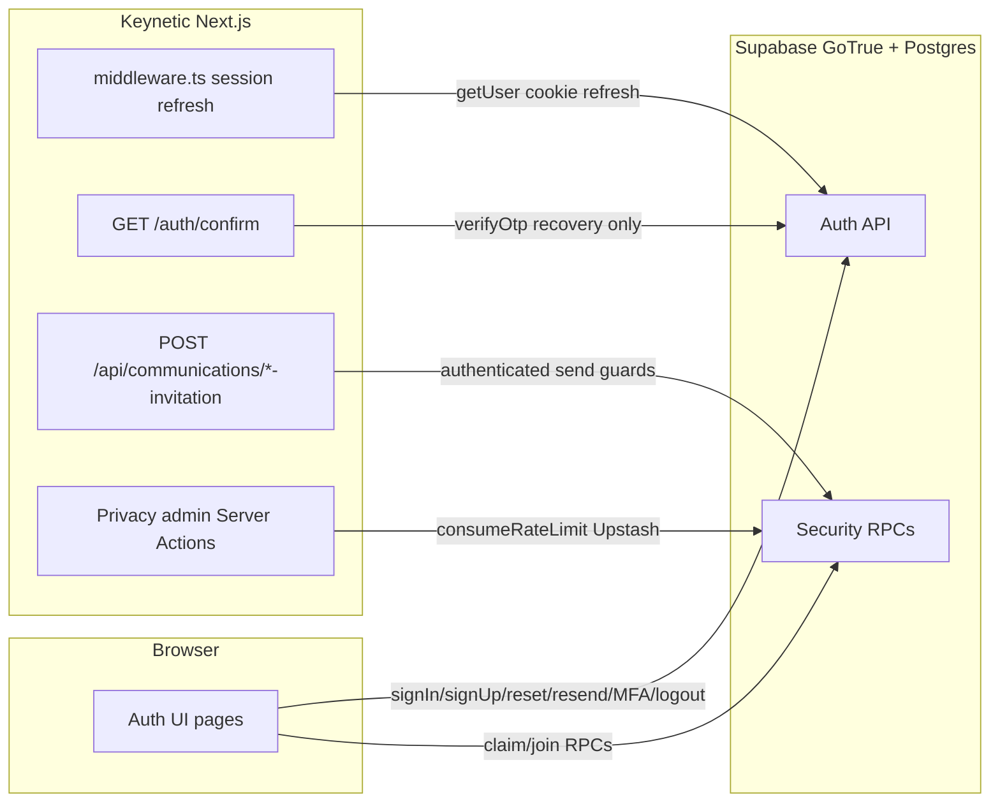

# SEC-104 — Authentication Abuse & Rate-Limiting Audit

**Workstream:** Pre-Launch Platform Security  
**Date:** 2026-07-25  
**Status:** **AUDIT COMPLETE — OPEN** (not closed; no implementation in this task)  
**Scope:** Authentication and account-management abuse surfaces only. Invitation *sending* is referenced for boundary separation; invitation security is treated as closed separately.

**Constraints honoured:** No application code changes, no migrations, no Supabase settings changes, no dependency installs, Development and Production environments untouched.

**Related docs:** `AUTH_SECURITY_AUDIT.md`, `SUPABASE_AUTH_DASHBOARD_CHECKLIST.md`, `ACCOUNT_SECURITY.md`, `PRELAUNCH_PLATFORM_SECURITY_ARCHITECTURE_AUDIT.md` §26.

---

## 1. Executive assessment

Keynetic’s authentication architecture is **predominantly browser → Supabase GoTrue direct**. Almost every credential, reset, resend, and MFA operation uses `createBrowserClient` (`lib/supabase.ts`) with the publishable anon key. Keynetic does **not** currently enforce application-layer rate limits on those surfaces.

**Supabase already provides meaningful protection** for email-triggering abuse (per-user cooldowns, project-wide email caps on built-in SMTP) and for token/verify endpoints (IP-based token bucket). Generic error mapping reduces enumeration on login, forgot-password, and most sign-up failures.

**The central gap is not “missing Redis on `/login`” in isolation.** It is a combination of:

1. **Trust-boundary reality:** App-layer Upstash limits on Keynetic server routes cannot authoritatively throttle browser-direct `supabase.auth.*` calls unless auth is proxied or Supabase Dashboard / Auth Hooks are configured.
2. **Unverified project configuration:** Exact Supabase limits on the Development and Production projects are **not provable from the repository** — founder Dashboard verification is a pre-launch gate.
3. **Residual exploitable paths at expected launch scale:**
   - Distributed password guessing against one account (many IPs; Supabase `/auth/v1/token` password grant shares the **Token** IP bucket — documented default **1800/hour with burst 30**, not per-account lockout).
   - Unauthenticated verification resend to arbitrary emails (`/verify-email`).
   - Sign-up / reset email volume within Supabase provider limits (cost, deliverability, nuisance).
   - Minor account-state enumeration via login “no session” messaging when email confirmation is enabled.
   - Server-side `/auth/confirm` recovery `verifyOtp` calls rate-limited by **Supabase-visible IP (Vercel egress)**, not end-user IP, unless `Sb-Forwarded-For` + secret key forwarding is enabled.

**Recommendation for launch:** **Minimum Launch** posture — founder verification of Supabase Auth Dashboard settings (rate limits, email confirmations, SMTP, OTP expiry, redirect allow-list) plus acceptance that browser-direct auth limits are Supabase-authoritative. Defer full auth proxying and CAPTCHA unless abuse is observed post-launch. Optional small follow-up (separate task): fix login unverified enumeration copy; consider Upstash on `/auth/confirm` only.

**Revised SEC-104 severity:** Downgrade standalone finding from **P1 → P2** (architectural gap + monitoring). Elevate **founder Supabase Auth Dashboard verification** to **P1 pre-production gate** (tracked under SEC-104 action items, not a separate exploit).

---

## 2. Auth surface inventory (matrix)

| # | Surface | Route / file | Client vs server | Supabase / RPC method | Attacker needs auth? | Sends email? | Mutates account? | Keynetic rate limit | Supabase rate limit | Upstash at boundary? |
|---|---------|--------------|------------------|----------------------|----------------------|--------------|------------------|---------------------|---------------------|----------------------|
| 1 | Homeowner login | `/login` · `app/login/page.tsx` | **Client** | `signInWithPassword` | No | No | Session only | **None** | `/auth/v1/token` (password grant) — IP bucket (**Token** limiter; docs: **1800/hr**, burst 30) · **REQUIRES FOUNDER DASHBOARD VERIFICATION** for project-specific values | No |
| 2 | Homeowner inline sign-up | `/login` · same | **Client** | `signUp` | No | Yes if confirmations on | Creates user | **None** | Signup per-user cooldown **60s**; email-send quotas; built-in SMTP **2 emails/hr project-wide** unless custom SMTP · **REQUIRES FOUNDER DASHBOARD VERIFICATION** | No |
| 3 | EA login | `/estate-agents/login` · `app/estate-agents/login/page.tsx` | **Client** | `signInWithPassword` | No | No | Session | **None** | Same as #1 | No |
| 4 | EA sign-up | `/estate-agents/signup` · `app/estate-agents/signup/page.tsx` | **Client** | `signUp` + `createEstateAgentProfile` RPC | No | Yes if confirmations on | User + EA profile | **None** | Same as #2 | No |
| 5 | EA branch invite sign-up | `/estate-agents/signup?token=` · same | **Client** | `signUp` (+ invite prefill via `previewEaBranchInvitation` RPC) | No | Yes if confirmations on | User + later join | **None** | Same as #2 | No |
| 6 | EA branch join (existing account) | `/estate-agents/join?token=` · `app/estate-agents/join/page.tsx` | **Client** | `acceptEaBranchInvitation` RPC (not GoTrue) | Yes to accept | No | Branch membership | **None** (invitation RPC) | N/A (Postgres RPC + token) | No |
| 7 | Logout | Navbar · `components/Navbar.tsx`, `AgentShell`, privacy admin shells | **Client** | `signOut` | Yes | No | Ends session | **None** | Low abuse value | No |
| 8 | Forgot password | `/forgot-password` · `app/forgot-password/page.tsx` | **Client** | `resetPasswordForEmail` | No | Yes | No (queues email) | **None** | Per-user **60s** between recover requests; email-send quotas · **REQUIRES FOUNDER DASHBOARD VERIFICATION** | No |
| 9 | Recovery OTP exchange | `GET /auth/confirm` · `app/auth/confirm/route.ts` | **Server** | `verifyOtp({ type: "recovery" })` | No (token in URL) | No | Creates recovery session | **None** | `/auth/v1/verify` — **360/hr per IP**, burst 30 · IP = **Vercel egress** unless forwarding enabled | **Yes** (route handler could use Upstash) |
| 10 | Choose new password | `/reset-password` · `components/account/ResetPasswordForm.tsx` | **Client** | `updateUser({ password })` | Recovery or signed-in session | No | Password hash | **None** | Password update via authenticated user endpoint | No |
| 11 | In-app password change | `/account#security` · `components/account/SecuritySection.tsx` | **Client** | `signInWithPassword` (re-auth) + `updateUser({ password })` | Yes | No | Password hash | **None** | Token + update endpoints | No |
| 12 | Email verification (confirm link) | Supabase-hosted / default redirect | **Supabase → browser** | Email link → `/auth/v1/verify` | No | No | Sets `email_confirmed_at` | **None** | Verify IP bucket | No |
| 13 | Resend verification email | `/verify-email` · `app/verify-email/page.tsx` | **Client** | `resend({ type: "signup", email })` | **No** (email field editable) | Yes | No | **None** | Signup confirmation **60s per user**; OTP send quotas · **REQUIRES FOUNDER DASHBOARD VERIFICATION** | No |
| 14 | Session refresh | Middleware / SSR · `middleware.ts`, `@supabase/ssr` | **Server + client** | `getUser` / refresh via cookies | Session cookie | No | Refreshes tokens | **None** | `/auth/v1/token` refresh — **1800/hr per IP** | No |
| 15 | Platform admin MFA enroll/verify | Privacy admin UI · `lib/auth/platformAdminMfaClient.ts` | **Client** | `mfa.enroll`, `mfa.challenge`, `mfa.verify` | Yes (platform admin) | No | MFA factors | **None** | MFA challenge/verify — **15/hr per IP** | No |
| 16 | Platform admin MFA status | `lib/auth/platformAdminMfaActions.ts` | **Server Action** | `mfa.getAuthenticatorAssuranceLevel` (read) | Yes | No | No | **None** | Low | No |
| 17 | Homeowner property claim | `/claim` · `app/claim/page.tsx` | **Client** | `resolveClaimInvitationToken` RPC + claim RPCs | Yes for claim | No | Property participation | **None** on RPC | N/A | No |
| 18 | Homeowner invitation **email send** | `POST /api/communications/homeowner-invitation` | **Server** | Resend + `email_events` audit (not GoTrue) | Yes | Yes (Resend) | Invitation state | **3 / 15 min** per property (`invitationSendSecurity.ts`) | N/A | **Yes** (DB audit, not Upstash) |
| 19 | EA invitation **email send** | `POST /api/communications/estate-agent-invitation` | **Server** | Resend + `email_events` | Yes | Yes (Resend) | Invitation state | **3 / 15 min** per recipient email | N/A | **Yes** (DB audit) |
| 20 | Email change | — | — | **Not implemented** | — | — | — | — | — | — |
| 21 | Anonymous sign-in | — | — | **Not used** | — | — | — | — | — | — |

**Notes:**

- **Invitation acceptance** (claim, EA join) uses opaque tokens and Postgres RPCs — separate from GoTrue abuse; sending is already rate-limited (§10).
- **Resend application invitations** (Resend provider) must not be confused with **Supabase Auth** verification or recovery emails.

---

## 3. Browser-direct vs Keynetic-server architecture

| Path | Authoritative rate limiter |
|------|----------------------------|
| Browser → Supabase Auth (rows 1–8, 10–14, 15) | **Supabase GoTrue only** — Keynetic cannot enforce Upstash without proxying |
| Browser → Keynetic API → Supabase | **Keynetic + Supabase** — only `/auth/confirm`, invitation APIs, privacy admin |
| Middleware session refresh | Supabase token refresh limits |

**Critical conclusion:** Client-side throttling is **not** a security control. Existing `isSubmitting` button disables are UX only.

**Application-layer rate limiting is not technically authoritative** for the majority of auth abuse surfaces unless Keynetic introduces server-side auth proxy routes or configures Supabase (Dashboard CAPTCHA, Auth Hooks, custom SMTP rate limits).

---

## 4. Current Supabase protections

### A. Provable from repository / official Supabase documentation

Source: [Supabase Auth rate limits](https://supabase.com/docs/guides/auth/rate-limits) (retrieved 2026-07-25). These are **platform defaults**; customizable items still require Dashboard verification on each project.

| Operation | Path | Limited by | Customizable? | Documented default |
|-----------|------|------------|---------------|-------------------|
| Email sends (signup/recover/email change) | `/signup`, `/recover`, `/user` | Project-wide combined | Custom SMTP only | **2 emails/hour** on built-in SMTP |
| OTP send | `/otp` | Project-wide | Yes | **30/hour** |
| OTP / magic link per user | `/otp` | Last request per user | Yes | **60 seconds** |
| Signup confirmation resend | `/signup` | Last request per user | Yes | **60 seconds** |
| Password reset request | `/recover` | Last request per user | Yes | **60 seconds** |
| Token verify | `/verify` | IP | No | **360/hour**, burst 30 |
| Token (password grant + refresh) | `/token` | IP | No | **1800/hour**, burst 30 |
| MFA challenge/verify | `/factors/...` | IP | No | **15/hour**, burst 30 |
| Anonymous signup | `/signup` (no email) | IP | No | **30/hour** — **not used by Keynetic** |

Additional repo-evidenced controls:

- Generic login error: `mapAuthSignInError()` → always `"Invalid email or password."`
- Generic forgot-password success: `PASSWORD_RESET_EMAIL_SENT_MESSAGE`
- Password policy enforced client-side before `signUp` / `updateUser`
- Recovery flow server-side OTP exchange at `/auth/confirm`
- Email verification gate on transaction participation (middleware + RPCs)

**Dashboard labelling caveat (provable from Supabase auth source/issues):** The Dashboard label *“Rate limit for sign-ups and sign-ins”* has historically mapped to **`rate_limit_otp`**, not password `signInWithPassword` throttling. Password login uses the **Token** endpoint IP bucket. Treat Dashboard labels as **REQUIRES FOUNDER DASHBOARD VERIFICATION** — confirm actual fields under **Authentication → Rate Limits**.

### B. Requires founder verification in Supabase Dashboard

| Item | Dashboard location |
|------|-------------------|
| All rate limit numeric values | **Authentication → Rate Limits** |
| CAPTCHA / Turnstile | **Authentication → Bot and Abuse Protection** (or CAPTCHA section per project UI) |
| Enable email confirmations | **Authentication → Providers → Email** |
| OTP / recovery expiry | **Authentication → Settings** (Email OTP / security settings) |
| Minimum password length / complexity | **Authentication → Providers → Email → Password requirements** |
| Leaked password protection (HIBP) | **Authentication → Settings → Password Security** (Pro+) |
| Custom SMTP + email send caps | **Project Settings → Auth → SMTP** |
| Redirect URL allow-list | **Authentication → URL Configuration** |
| Site URL | **Authentication → URL Configuration** |
| IP forwarding for server-side auth (`Sb-Forwarded-For`) | **Authentication → Rate Limits → IP Address Forwarding** |
| MFA providers | **Authentication → Providers → MFA** |
| Auth Hooks (password verification hook) | **Authentication → Hooks** |

Use checklist: `docs/SUPABASE_AUTH_DASHBOARD_CHECKLIST.md`.

### C. Assumptions that cannot be proven from the repo

- Actual Development / Production values for every limit above
- Whether custom SMTP is configured (Production likely required; affects email-send caps)
- Whether CAPTCHA is enabled
- Whether email confirmations are enabled (inferred from UX but not guaranteed)
- Whether `security_sb_forwarded_for_enabled` is true
- Per-account lockout after N failed passwords (**Supabase does not provide this by default** — requires Auth Hook)
- Exact behaviour of mislabelled Dashboard “sign-ups/sign-ins” slider on the live project

---

## 5. Founder dashboard checks required

Before Production launch, founder must verify on **both** Development and Production projects:

1. **Authentication → Rate Limits** — record all values; confirm OTP/signup/recover cooldowns; understand Token vs Verify buckets.
2. **Authentication → Providers → Email** — confirmations **enabled**; password rules ≥ Keynetic policy (10 chars + complexity).
3. **Authentication → URL Configuration** — Site URL + redirect allow-list includes `/auth/confirm`, `/reset-password`.
4. **Authentication → Settings** — recovery OTP expiry **900s** recommended; secure email change if available.
5. **Project Settings → Auth → SMTP** — custom SMTP for Production; understand email rate limits.
6. **Authentication → Bot and Abuse Protection** — CAPTCHA **off** at launch unless pen-test mandates (audit recommendation).
7. **Authentication → Rate Limits → IP Address Forwarding** — evaluate enabling before scaling `/auth/confirm` traffic.
8. Optional: **Authentication → Hooks** — password verification hook if per-account brute-force throttle desired (Hardened option).

Document results in runbook; do not infer Production from Development.

---

## 6. Login / brute-force assessment

| Threat | Current protection | Remaining risk | Launch severity |
|--------|-------------------|----------------|-----------------|
| Credential stuffing (many passwords, one email) | IP token bucket on `/auth/v1/token`; generic error | Distributed IPs bypass per-IP cap; **no per-account lockout** | **Medium** |
| Wrong password retries (single IP) | ~1800/hr IP limit with burst 30 | Attacker can try ~30 rapid guesses then sustained rate | **Medium** at launch scale |
| Distributed attack | Same as above | High volume across botnet still bounded per IP but aggregate damage possible | **Medium** |
| Account enumeration via login errors | Mapped to generic message | **Leak:** `!session` path shows verification hint (`app/login/page.tsx` L85–88) | **Low–Medium** |
| Unverified / disabled / nonexistent | Supabase returns `invalid_credentials` for most; app maps sign-in errors generically | Sign-up path soft-confirms duplicates | **Low** |

**Is Supabase alone sufficient for launch?** **Yes, with founder Dashboard verification and monitoring**, for expected early-adopter scale. **Not sufficient** for high-profile targeted attack without Auth Hook or auth proxy.

**Where Keynetic can enforce additional controls:** Server auth proxy (Balanced/Hardened); Auth Hook (Hardened); fix enumeration copy (small app change); Upstash on `/auth/confirm` only.

---

## 7. Sign-up abuse assessment

| Threat | Current protection | Remaining risk | Launch severity |
|--------|-------------------|----------------|-----------------|
| Automated account creation | Supabase signup limits + email caps | Public homeowner + EA signup; DB row + auth user cost | **Low–Medium** |
| Fake volume / email flooding | Built-in SMTP 2/hr project-wide unless custom SMTP | Custom SMTP raises ceiling — monitor | **Medium** if SMTP misconfigured |
| Email verification required? | **REQUIRES FOUNDER DASHBOARD VERIFICATION** | If off, accounts fully usable except transaction gate | **P1 config** |
| Invitation-only vs public | Homeowner: public sign-up on `/login`; EA: public + invite prefill | Invite flows do not restrict account creation | **Low** (by product design) |

**CAPTCHA at launch:** **Defer** — enable via Supabase Dashboard on signup (+ optionally recover) if signup spam appears. Minimum Launch does not require CAPTCHA.

---

## 8. Password reset / email abuse assessment

| Threat | Current protection | Remaining risk | Launch severity |
|--------|-------------------|----------------|-----------------|
| Email bombing one address | Per-user **60s** recover cooldown; project email caps | Attacker can still send periodic resets across days | **Low** |
| Account enumeration | Generic success message always shown | **Good** — no existence leak in UI | **Low** |
| Repeated reset requests | Supabase per-user cooldown | UX annoyance to victim | **Low** |
| Token expiry / reuse | Server `verifyOtp`; mapped errors | **Good** — see `authConfirm.ts` | **Low** |
| Redirect safety | `buildPasswordRecoveryConfirmUrl`; `resolveAuthConfirmDestination` | Open redirect hardened for confirm | **Low** |

**Safe response semantics (current — keep):**

- Forgot password: always show `PASSWORD_RESET_EMAIL_SENT_MESSAGE` on non-error; generic error on transport failure.
- Never reveal account existence on public reset.

---

## 9. Verification / OTP / resend abuse assessment

| Flow | Auth required? | Arbitrary email target? | Limits |
|------|----------------|-------------------------|--------|
| `/verify-email` resend | **No** | **Yes** — email input editable | Supabase signup resend **60s/user** + email quotas |
| Signup confirmation link | No | N/A | Verify IP limit |
| Recovery OTP | No (token) | N/A | Per-user recover cooldown + verify limit |
| Platform admin MFA OTP | Yes | N/A | MFA IP limit |

**Distinction:** Resend **property/EA invitations** (`/api/communications/*`) requires authenticated agent + `evaluateInvitationSendGuards` — **not** an auth email.

**Risk:** Unauthenticated verification resend allows harassment of arbitrary inboxes at Supabase-provider pace. Mitigation today is Supabase-side only.

---

## 10. Invitation interaction assessment

Existing invitation send rate limits (**closed separately**):

| Flow | Limit | Mechanism |
|------|-------|-----------|
| Homeowner invitation email | 3 / 15 min | `email_events` count per `property_id` |
| EA branch invitation email | 3 / 15 min | `email_events` count per `recipient_email` |
| Re-invitations | Same counters | Idempotency window 60s |

**Auth interaction:** Accepting invitations requires sign-in (or sign-up then sign-in). Token preview RPCs reveal invite validity — **expected** for invite links, not public email oracle.

**No reopening of invitation security** unless auth resend paths bypass invitation intent — they do not.

---

## 11. Existing Upstash infrastructure

| Item | Detail |
|------|--------|
| Dependency | `@upstash/redis` ^1.38.0 (`package.json`) |
| Config | `UPSTASH_REDIS_REST_URL`, `UPSTASH_REDIS_REST_TOKEN` |
| Helper | `lib/cache/rateLimit.ts` — `consumeRateLimit`, `peekRateLimit`, `rateLimitHeaders` |
| Key format | `rate-limit:<route>:<identifier>` via `lib/cache/cacheKeys.ts` |
| Algorithm | Fixed window (`INCR` + `EXPIRE`) |
| Default failure | **Fail-open** (`failOpen: true`) |
| Fail-closed example | Privacy admin subject lookup — `failOpen: false` (`lib/privacyAdmin/actions.ts`) |
| Protected routes today | Privacy admin subject lookup only (20/min per admin user ID) |
| Auth routes | **Not wired** |
| Env separation | Keys include route + identifier only — **no explicit env prefix**; rely on separate Upstash instances per Vercel env |
| Privacy | `sanitiseKeySegment` lowercases identifiers — **do not store raw emails**; use SHA-256(email.normalized) for account buckets |

**Reuse for auth:** Technically suitable for **server-boundary** routes (`/auth/confirm`, hypothetical auth proxy). **Unsuitable as sole control** for browser-direct GoTrue without architectural change.

---

## 12. IP address trust (Vercel)

| Context | Trust model |
|---------|-------------|
| Browser → Supabase direct | Supabase sees **client public IP** — appropriate for auth rate limiting |
| Keynetic server → Supabase (`/auth/confirm`) | Supabase sees **Vercel egress IP** unless `Sb-Forwarded-For` enabled with **secret** key |
| Future Keynetic proxy | Use Vercel-trusted client IP: `x-forwarded-for` first hop or `x-real-ip` per [Vercel headers](https://vercel.com/docs/headers/request-headers) — **do not trust client-supplied XFF on non-Vercel paths** |
| IPv6 / shared NAT | IP-only limits may aggregate office/household users — prefer **account-hash** dimensions for sensitive server proxies |
| Spoofing | Arbitrary `x-forwarded-for` from browsers is irrelevant for direct Supabase calls; only matters on server routes behind Vercel |

---

## 13. Account enumeration assessment

| Surface | Can attacker learn “email has account”? | Classification |
|---------|------------------------------------------|----------------|
| Login (wrong password) | No — generic message | **Mitigated** |
| Login (valid password, unverified) | **Possible** — distinct “no session” message | **Gap — P2** |
| Sign-up duplicate | Soft — “may already exist” | **Acceptable** |
| Forgot password | No — generic success | **Mitigated** |
| Resend verification | No — generic success copy | **Mitigated** |
| Invitation token invalid | Token-specific errors | **Unavoidable for invite semantics** |
| EA join wrong email | `formatEaBranchInvitationError` | **Authenticated invite context** |

---

## 14. CAPTCHA recommendation

| Option | Launch posture |
|--------|----------------|
| No CAPTCHA | **Recommended (Minimum Launch)** |
| Supabase Turnstile/hCaptcha on signup + recover | Enable via Dashboard if abuse observed |
| Cloudflare sitewide | Not required |
| Client-only CAPTCHA | **Reject** as security control |

**Privacy:** CAPTCHA involves third-party processing — document in privacy materials if enabled (PECR/marketing distinction does not apply; legitimate interest/security basis likely).

---

## 15. Attacker scenario matrix

| # | Scenario | Current protection | Remaining risk | Recommended control | Launch severity |
|---|----------|-------------------|----------------|---------------------|-----------------|
| 1 | 100 password guesses, one account | IP token bucket + generic errors | ~30 burst then throttled; no account lockout | Dashboard verify; monitor; optional Auth Hook | Medium |
| 2 | One password vs 1,000 emails | Per-IP token limit | Credential stuffing scan | Same | Medium |
| 3 | 100 reset requests, one email | 60s/user cooldown | ~100 over ~100 minutes max steady | Keep generic UX; SMTP caps | Low |
| 4 | 1,000 signup attempts | IP + email project limits | DB/auth user noise | CAPTCHA if observed; confirmations on | Low–Medium |
| 5 | Repeated verification resend | 60s/user + email caps | Harassment | Supabase limits; optional proxy | Low–Medium |
| 6 | Distributed across IPs | Per-IP buckets only | Aggregate brute force | Auth Hook / proxy (Hardened) | Medium |
| 7 | Legitimate office, many EAs, one IP | 1800 token/hr shared | Rare lockout at peak | Monitor; account-hash if proxy added | Low |
| 8 | Homeowner double-clicks resend | 60s cooldown + UI disabled while pending | Annoyance only | UX (already partially there) | Low |
| 9 | Attacker knows invite recipient email | Invite token still required | No password bypass | Already hardened send limits | Low |
| 10 | Redis unavailable during login/signup | N/A — auth bypasses Redis | No change | Fail-open acceptable for auth (if proxy added, define per surface) | Low |

---

## 16. Revised SEC-104 severity

| Finding | Prior | Revised | Rationale |
|---------|-------|---------|-----------|
| SEC-104 “No app-layer auth rate limiting” | P1 | **P2** | Browser-direct auth cannot be fixed by Redis alone; Supabase provides baseline; no proven active exploit at launch scale |
| Supabase Auth config unverified on Production | (implicit) | **P1 gate** | Must verify before Production traffic |
| Login unverified enumeration message | (not tracked) | **P2** | Small app fix — separate ticket |
| `/auth/confirm` shared egress IP | (not tracked) | **P3** | Low volume at launch; enable IP forwarding if needed |

**Do not mark SEC-104 closed** until founder Dashboard verification is recorded and launch option approved.

---

## 17. Implementation option — MINIMUM LAUNCH

| | |
|--|--|
| **Controls** | Founder Dashboard verification; custom Production SMTP; email confirmations on; generic enumeration-safe copy (already mostly present); monitor Supabase Auth logs |
| **Architecture** | No change — browser-direct auth |
| **Dependencies** | None new |
| **UX impact** | None |
| **Operational complexity** | Low — checklist once per environment |
| **Cost** | SMTP provider only |
| **Threats mitigated** | Email bombing (partial), reset spam, baseline brute force |

---

## 18. Implementation option — BALANCED

| | |
|--|--|
| **Controls** | Minimum Launch + Upstash on `/auth/confirm` (fail-closed optional) + server-side auth proxy for `resetPasswordForEmail` and `resend` only |
| **Architecture** | Thin Next.js Route Handlers proxying select GoTrue calls with IP + email-hash limits |
| **Dependencies** | Existing Upstash; optional `@supabase/supabase-js` server secret for forwarded IP |
| **UX impact** | Low — same forms, different API target |
| **Operational complexity** | Medium |
| **Cost** | Upstash request volume modest |
| **Threats mitigated** | Arbitrary resend/reset harassment; recovery verify burst from shared egress |

---

## 19. Implementation option — HARDENED

| | |
|--|--|
| **Controls** | Balanced + full auth proxy (login/signup) + Supabase CAPTCHA + Password Verification Auth Hook (per-user failed attempt throttle) + alerting |
| **Architecture** | Keynetic as auth edge; Supabase as credential store |
| **Dependencies** | CAPTCHA keys; Auth Hook migration; possible secret key for Sb-Forwarded-For |
| **UX impact** | Medium — CAPTCHA friction on signup/recover |
| **Operational complexity** | High |
| **Cost** | CAPTCHA + Redis + hook maintenance |
| **Threats mitigated** | Distributed credential stuffing; signup bots |

---

## 20. Recommended option

**MINIMUM LAUNCH** for Keynetic’s expected launch scale.

Rationale: Supabase GoTrue already rate-limits the highest-risk email and token endpoints; generic errors reduce enumeration; invitation auth-adjacent abuse is separately controlled; full auth proxy cost exceeds realistic pre-launch threat at current scale.

**Parallel P1 action:** Complete `SUPABASE_AUTH_DASHBOARD_CHECKLIST.md` on Development (test) then Production (activate).

**Post-launch tripwires for Balanced:** elevated 429 rates, signup spam, reset harassment tickets, pen-test findings.

---

## 21. Proposed rate-limit dimensions (if Balanced+ implemented later)

| Surface | Dimensions | Notes |
|---------|------------|-------|
| Login proxy | `ip` + `sha256(normalized_email)` | Combine: block only when both hot |
| Sign-up proxy | `ip` | Higher threshold (10/hr) |
| Forgot password proxy | `ip` + email hash | 5/hr per email hash |
| Resend verification proxy | `ip` + email hash | 3/hr per email hash |
| `/auth/confirm` | `ip` (client) + token hash prefix | Prevent verify spam |
| Global circuit breaker | project-wide signup emails/hr | Alert founder |

Never store raw emails in Redis keys — use `sha256(trim.toLowerCase(email))`.

---

## 22. Proposed failure semantics

| Event | HTTP | User message | Retry-After |
|-------|------|--------------|-------------|
| Rate limited (server proxy) | **429** | “Too many attempts. Please wait a few minutes and try again.” | Yes — seconds until window reset |
| Supabase 429 passthrough | **429** | Same generic copy | If header present |
| Normal auth failure | **401/400** | Existing generic copy | No |
| Logging | Structured info log `auth_rate_limited` with route + ip hash | | |
| Sentry | **Do not capture** routine 429 — metric only | | |
| Repeated abuse | Founder alert if >N/hr project-wide | | |

---

## 23. Redis failure strategy

| Surface | Fail-open vs fail-closed |
|---------|--------------------------|
| Browser-direct auth (today) | N/A — Redis not in path |
| Privacy admin (existing) | **Fail-closed** |
| Hypothetical auth proxy (login/signup) | **Fail-open** — preserve availability; Supabase still limits |
| Hypothetical `/auth/confirm` limit | **Fail-open** at launch — prefer successful recovery |
| Hypothetical reset/resend proxy | **Fail-open** with logging |

---

## 24. Privacy / data minimisation

- Rate-limit keys: use route slug + hashed identifiers only.
- Logs: log rate-limit events without email/password; use request id + hash prefix.
- Do not write failed passwords or OTP tokens to Redis.
- CAPTCHA (if enabled): update privacy policy / DPIA for third-party processor.

---

## 25. Observability recommendation

| Signal | Action |
|--------|--------|
| Supabase Dashboard → Auth logs | Weekly review first month |
| 429 rate from GoTrue | Dashboard metric |
| Custom proxy 429 | Vercel log drain / structured log — **not Sentry** |
| Signup volume anomaly | Alert threshold e.g. 2× baseline day |
| Email bounce/complaint | SMTP provider |

---

## 26. Test plan (recommended option — Minimum Launch)

| # | Test | Method |
|---|------|--------|
| 1 | Normal login | Manual — homeowner + EA |
| 2 | Several incorrect passwords | Manual — expect generic error; note Supabase 429 only at high volume |
| 3 | Threshold behaviour | Staging — controlled burst; **do not spam Production** |
| 4 | Reset spam | Manual — 2–3 rapid resets same email; expect cooldown |
| 5 | Signup abuse | Staging — small batch only |
| 6 | Shared IP | Two test accounts same network — login both |
| 7 | Account-hash limiting | N/A at Minimum Launch |
| 8 | Redis failure | N/A for auth at Minimum Launch |
| 9 | Preview vs Production | Run checklist on both projects separately |
| 10 | No PII in logs | Review Vercel / Supabase log samples |
| 11 | No enumeration | Compare messages: wrong password vs unknown email vs unverified |
| 12 | No security regression | `npx tsx scripts/verify-auth-password-policy.ts`; platform security verifiers unchanged |

**Do not send large volumes of real emails** — use Supabase staging + single test inboxes.

---

## 27. Production considerations

| Control type | Examples |
|--------------|----------|
| Application code | Enumeration copy fix; future proxy (not in this task) |
| Vercel config | Env vars for Upstash when used |
| Supabase Dashboard | Rate limits, SMTP, confirmations, CAPTCHA, hooks |
| Environment variables | `UPSTASH_*`, Supabase keys |
| External provider | Resend (invitations — separate), SMTP |

**Development testing ≠ Production activation.** Record Dashboard state per project ref.

---

## 28. Files reviewed

- `app/login/page.tsx`, `app/forgot-password/page.tsx`, `app/verify-email/page.tsx`
- `app/estate-agents/login/page.tsx`, `app/estate-agents/signup/page.tsx`, `app/estate-agents/join/page.tsx`
- `app/auth/confirm/route.ts`, `app/claim/page.tsx`
- `app/api/communications/homeowner-invitation/route.ts`, `app/api/communications/estate-agent-invitation/route.ts`
- `components/account/SecuritySection.tsx`, `components/account/ResetPasswordForm.tsx`
- `components/Navbar.tsx`, `components/claim/ClaimInvitationError.tsx`
- `lib/supabase.ts`, `lib/supabase/server.ts`
- `lib/auth/authErrors.ts`, `lib/auth/passwordPolicy.ts`, `lib/auth/passwordReset.ts`, `lib/auth/authConfirm.ts`
- `lib/auth/platformAdminMfaClient.ts`, `lib/auth/platformAdminMfaActions.ts`
- `lib/cache/rateLimit.ts`, `lib/cache/redis.ts`, `lib/cache/cacheKeys.ts`
- `lib/communications/invitationSendSecurity.ts`
- `lib/privacyAdmin/actions.ts`
- `middleware.ts`
- `docs/AUTH_SECURITY_AUDIT.md`, `docs/SUPABASE_AUTH_DASHBOARD_CHECKLIST.md`, `docs/ACCOUNT_SECURITY.md`
- `docs/PRELAUNCH_PLATFORM_SECURITY_ARCHITECTURE_AUDIT.md`
- Supabase official rate limits documentation

---

## 29. Files changed (documentation only)

- `docs/SEC-104_AUTHENTICATION_ABUSE_RATE_LIMITING_AUDIT.md` (this file) — **created**
- `docs/PRELAUNCH_PLATFORM_SECURITY_ARCHITECTURE_AUDIT.md` — §26 cross-reference; SEC-104 severity note
- `docs/AUTH_SECURITY_AUDIT.md` — Part 10 SEC-104 summary
- `docs/SUPABASE_AUTH_DASHBOARD_CHECKLIST.md` — expanded rate-limit verification notes

---

## 30–33. Confirmations & next action

| # | Confirmation |
|---|--------------|
| 30 | **No application code changed** in this audit task |
| 31 | **No migrations created or applied** |
| 32 | **Development environment untouched** |
| 33 | **Production environment untouched** |

### Exact recommended next action (founder approval required)

**Complete Supabase Auth Dashboard verification** on the **Production** Supabase project using `docs/SUPABASE_AUTH_DASHBOARD_CHECKLIST.md` and §5 of this document — record rate limits, enable email confirmations, configure custom SMTP, set OTP expiry to 900s, confirm redirect allow-list — **before** Production launch. Accept **Minimum Launch** architecture (browser-direct auth, Supabase-authoritative limits) unless pen-test or abuse metrics mandate Balanced controls.

Optional follow-up ticket (not SEC-104 closure): normalize login “no session” message to preserve enumeration safety.

---

## Central question — answer

**What abuse can an attacker realistically perform today despite Supabase?**

At expected launch scale, an attacker can: (1) attempt distributed password guessing within per-IP `/token` limits without account lockout; (2) trigger periodic signup/recovery/verification emails to targeted addresses within Supabase per-user and project email caps; (3) create modest volumes of fake accounts if signup remains public; (4) infer unverified-account state from one login edge-case message.

**Smallest additional control set:** **Founder-verified Supabase Dashboard configuration** (confirmations, SMTP, rate limits, OTP expiry, redirects) plus operational monitoring — **not** a full Keynetic Redis auth layer. Add Balanced proxy/CAPTCHA only if abuse materialises.

---

*SEC-104 audit — OPEN. Implementation deferred pending founder approval of recommended option.*
